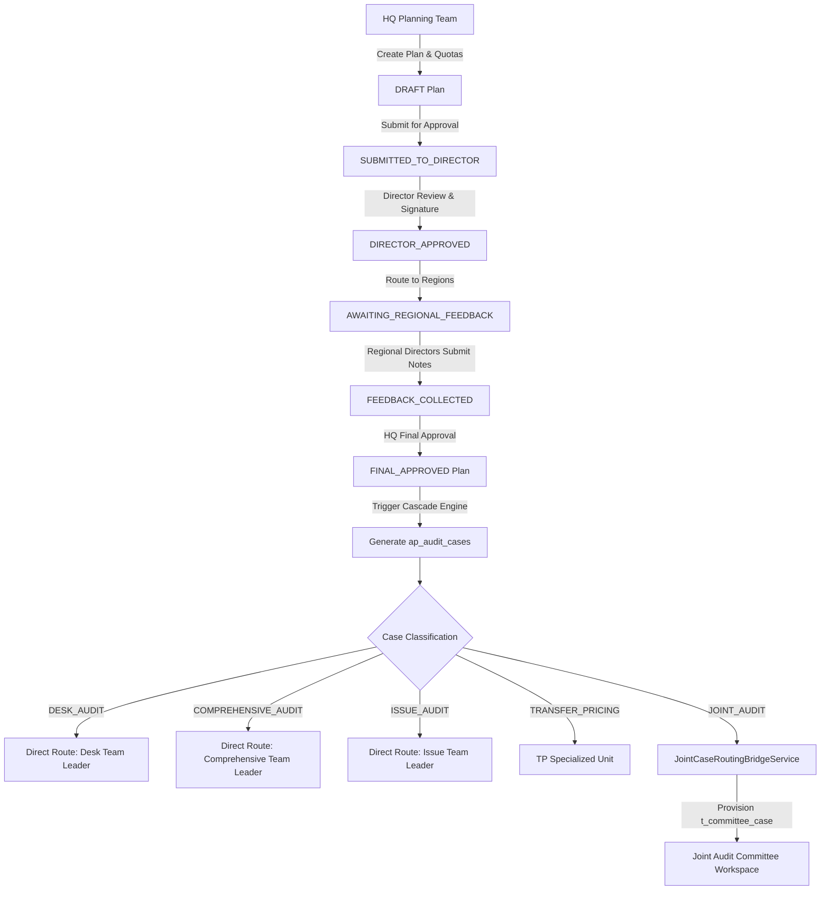
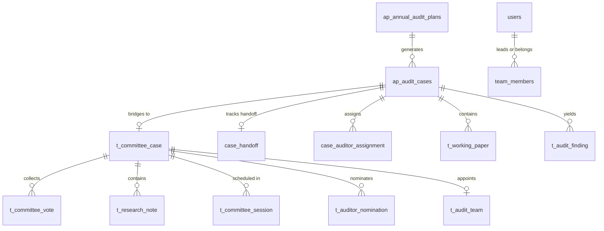

# ITAS Tax Audit System: Master Architecture, Workflow & Joint Audit Specification Guide

> **Document Type**: Architecture & Engineering Specification / AI Master Prompt Guide  
> **System**: Integrated Tax Administration System (ITAS) - Tax Audit Subsystem  
> **Core Submodules**: Annual Audit Planning (AP), Risk Engine, Transfer Pricing (TP), Joint Audit Committee (JAC) & Execution Workspace  
> **Author**: Antigravity Engineering Pair  
> **Date**: September 2026  

---

## 1. System Engineering & Build Foundation

### 1.1 Technology Stack Matrix

| Layer | Technology | Key Dependencies / Libraries | Port & Binding |
|---|---|---|---|
| **Backend Server** | Java 21, Spring Boot 3.2.5 | Spring Data JPA, Hibernate ORM 6.4.4, Flyway 9.22, Hypersistence Utils 3.7.3, Lombok, Jackson | `http://localhost:8080` |
| **Database** | PostgreSQL 16-alpine (Docker) | `taxaudit-postgres` container, 76 relational schema tables, JSONB support, UUID primary keys | `localhost:5433` -> internal `5432` (`itas_audit` DB) |
| **Frontend UI** | React 19, Vite 8 | Tailwind CSS 3.4, Lucide React Icons, Native Fetch / Context API, Server-Sent Events (SSE) | `http://localhost:3000` (Vite dev server with `/api` proxy) |
| **Security & Auth** | Spring Security 6.1, Mock Mode | `MockSecurityConfig` (Profile: `mock`), Header-based RBAC (`X-Actor-Id`, UUID actor resolution) | Permissive CORS for `localhost:3000` |

---

### 1.2 Infrastructure Setup & Startup Topology

```
   ┌────────────────────────────────────────────────────────┐
   │             User Browser (React 19 / Vite)             │
   │                 http://localhost:3000                  │
   └──────────────────────────┬─────────────────────────────┘
                              │
               Proxy: /api/*  │  Direct: Assets & UI
                              ▼
   ┌────────────────────────────────────────────────────────┐
   │          Spring Boot Monolithic Core Server            │
   │                 http://localhost:8080                  │
   │                                                        │
   │  ┌──────────────────┐            ┌──────────────────┐  │
   │  │ Planning & Quota │            │   Joint Audit    │  │
   │  │     Engine       │            │  Bridge Service  │  │
   │  └────────┬─────────┘            └────────┬─────────┘  │
   │           │                               │            │
   │           ▼                               ▼            │
   │  ┌──────────────────────────────────────────────────┐  │
   │  │   Domain Services, JPA Repositories & Entities   │  │
   │  └────────────────────────┬─────────────────────────┘  │
   └───────────────────────────┼────────────────────────────┘
                               │
                JDBC URL: localhost:5433/itas_audit
                               ▼
   ┌────────────────────────────────────────────────────────┐
   │         Docker Container: taxaudit-postgres            │
   │                 Port 5433 (PostgreSQL 16)              │
   │       Credentials: itas_dev / dev_password             │
   │       Database: itas_audit (76 Tables)                 │
   └────────────────────────────────────────────────────────┘
```

#### Portable Startup Scripts

1. **Backend Server (`start-backend.sh`)**:
   - Resolves script directory dynamically.
   - Enforces Java 21: `export JAVA_HOME=/usr/lib/jvm/java-21-openjdk-amd64`.
   - Overrides PostgreSQL port: `export DB_PORT=5433`.
   - Executes Spring Boot in mock profile:
     ```bash
     mvn spring-boot:run -Dspring-boot.run.profiles=mock -DskipTests
     ```

2. **Frontend UI (`start-frontend.sh`)**:
   - Resolves script directory dynamically.
   - Ensures Node.js 20+ PATH: `export PATH="/home/josi-coder/.nvm/versions/node/v20.20.0/bin:$PATH"`.
   - Executes Vite dev server:
     ```bash
     cd frontend/back-office-ui && exec npm run dev
     ```

3. **Vite Reverse Proxy (`vite.config.js`)**:
   - Serves frontend on port 3000.
   - Proxies all requests matching `/api/**` to `http://localhost:8080` with `changeOrigin: true`.

---

## 2. Global Project Workflow: Annual Plan to Cascaded Cases



### 2.1 Audit Stream Distribution Matrix

When an Annual Audit Plan reaches `FINAL_APPROVED`, the system cascades the quotas down to specific registered taxpayers in each Tax Center (e.g. `addis_ababa-tc1`, `federal-lto1`, `oromia-tc1`). Each generated case is routed based on risk profile and compliance complexity:

1. **Desk Audit (`DESK_AUDIT`)**: Lower risk, single-period, office-bound verification. Assigned directly to Tax Center Desk Audit Team Leader.
2. **Comprehensive Audit (`COMPREHENSIVE_AUDIT`)**: Multi-tax (VAT, CIT, Withholding), on-site verification. Assigned directly to Comprehensive Audit Team Leader.
3. **Issue / Spot Audit (`ISSUE_AUDIT`)**: High-priority anomaly or whistle-blower trigger focusing on a specific tax invoice or withholding violation.
4. **Transfer Pricing Audit (`TRANSFER_PRICING`)**: Multinational cross-border transaction, royalty matching, thin capitalization, and OECD arm's-length testing.
5. **Joint Audit (`JOINT_AUDIT`)**: High-value, multi-agency investigation triggered by significant variances between Customs (ASYCUDA) and Domestic Tax (SIGTAS/ITAS). Handed off exclusively to the Joint Audit Committee (JAC).

---

## 3. Exhaustive Deep-Dive: The Joint Audit (JAC) Lifecycle

### 3.1 Why Joint Audits Exist
Joint audits represent the highest tier of inter-agency tax compliance. In typical developing and middle-income tax administrations (e.g., the Ethiopian Ministry of Revenue), substantial tax leakage occurs at the interface between **Customs import/export declarations** and **Domestic tax filings** (VAT, Corporate Income Tax, Excises). 

Common triggers for Joint Audits include:
- **Customs Valuation Variance**: Declared import customs values exceed domestic cost-of-goods-sold (COGS) deductions by more than 35%.
- **Duty-Free Discrepancy**: Duty-free capital good exemptions never utilized in verified production facilities.
- **Foreign Currency Smurfing**: Discrepancies between National Bank FX allocations, Customs clearing documents, and local sales turnover.

Because of legal sensitivities, joint audits require statutory multi-agency oversight, formal viability clearance, inter-agency voting, and multi-disciplinary teams (Customs valuation experts, VAT auditors, forensic accountants).

---

### 3.2 The 7 Phases of the Joint Audit Lifecycle

```
┌─────────────────────────────────────────────────────────────────────────────┐
│ PHASE 1: INGESTION & BRIDGE ROUTING                                         │
│ • ap_audit_cases (type = JOINT_AUDIT)                                       │
│ • JointCaseRoutingBridgeService provisions t_committee_case (PENDING_VIAB)  │
└──────────────────────────────────────┬──────────────────────────────────────┘
                                       │
                                       ▼
┌─────────────────────────────────────────────────────────────────────────────┐
│ PHASE 2: COMMITTEE RESEARCH & DELIBERATION                                  │
│ • Cross-Agency Dossier Review (ASYCUDA vs SIGTAS variances)                 │
│ • Research Notes, Comments & Attachments (t_research_note)                  │
│ • Session Scheduling & Deliberation Minutes (t_committee_session)           │
└──────────────────────────────────────┬──────────────────────────────────────┘
                                       │
                                       ▼
┌─────────────────────────────────────────────────────────────────────────────┐
│ PHASE 3: ADVISORY VOTING & VIABILITY FINALIZATION                           │
│ • Committee Members cast advisory votes: APPROVE / REJECT (t_committee_vote)│
│ • Live Vote Tallying & Quorum Validation                                    │
│ • Chairperson Finalizes Viability Decision with Digital Signature           │
│ • Status updates to VIABILITY_APPROVED                                      │
└──────────────────────────────────────┬──────────────────────────────────────┘
                                       │
                                       ▼
┌─────────────────────────────────────────────────────────────────────────────┐
│ PHASE 4: AUDIT TEAM NOMINATION & APPOINTMENT                                │
│ • Tax Center Auditor pool query with skill filtering (t_auditor)            │
│ • Nominations logged in t_auditor_nomination                                │
│ • Chairperson designates Team Leader + Members (t_audit_team)               │
└──────────────────────────────────────┬──────────────────────────────────────┘
                                       │
                                       ▼
┌─────────────────────────────────────────────────────────────────────────────┐
│ PHASE 5: CASE HANDOFF & TRANSFER TO EXECUTION                               │
│ • Chairperson issues Transfer to Execution                                  │
│ • Atomic HandoffService writes case_handoff & updates ap_audit_cases        │
│ • Status transitions: TEAM_ASSIGNED                                         │
└──────────────────────────────────────┬──────────────────────────────────────┘
                                       │
                                       ▼
┌─────────────────────────────────────────────────────────────────────────────┐
│ PHASE 6: TEAM LEADER WORKSPACE & AUDITOR ASSIGNMENT                         │
│ • Team Leader accesses assigned case queue                                  │
│ • Team Member validation (C2 cross-team prevention, C3 empty team check)    │
│ • Assigns specific Auditor -> case_auditor_assignment created               │
│ • Status transitions: AUDITOR_ASSIGNED                                      │
└──────────────────────────────────────┬──────────────────────────────────────┘
                                       │
                                       ▼
┌─────────────────────────────────────────────────────────────────────────────┐
│ PHASE 7: 10-STEP EXECUTION WORKSPACE (AUDITOR RUNTIME)                      │
│ 1. Formal Notice Issuance          6. Working Papers Compilation            │
│ 2. Preliminary Meeting             7. Draft Findings & Concurrence          │
│ 3. Document Request & Tracking     8. Formal Exit Conference                │
│ 4. Fieldwork Investigation         9. Final Assessment & Demand Notice      │
│ 5. CAATs Anomaly Verification     10. Objection Resolution & Closure        │
└─────────────────────────────────────────────────────────────────────────────┘
```

---

### 3.3 Detailed Phase Breakdown

#### Phase 1: Ingestion & Bridge Routing
- **Actor**: Automated Cascade Engine / Background Bridge.
- **Service**: `mor.itas.domain.service.ap.JointCaseRoutingBridgeService`.
- **Database Tables**: Reads `ap_audit_cases`, inserts into `t_committee_case`.
- **Logic**:
  1. Detects cases where `audit_type IN ('JOINT', 'joint_audit', 'jointaudit')`.
  2. Resolves the designated Committee Chair for the target Tax Center via `UserJpaRepository`.
  3. Checks idempotency: if `findByOriginalCaseId(originalCaseId)` exists, skips re-creation.
  4. Hydrates deep taxpayer metadata (turnover, sector, risk indicators, compliance history).
  5. Inserts a record in `t_committee_case` with:
     - `status = 'PENDING_VIABILITY'`
     - `case_code = originalCase.caseNumber`
     - `chairperson_id = designatedChairId`
     - `original_case_id = apCase.id`

#### Phase 2: Committee Research & Deliberation
- **Actors**: Committee Chairperson (`ROLE_CHAIRPERSON`), Committee Members (`ROLE_COMMITTEE_MEMBER`).
- **UI Components**: `CommitteeDashboard.jsx`, `CommitteeCases.jsx`, `ResearchWorkspace.jsx`, `SessionManager.jsx`.
- **Capabilities**:
  - **Dossier Exploration**: Review taxpayer's risk score, declared import value vs domestic revenue, customs clearing station, and tax representative details.
  - **Collaborative Research**: Post structured research notes with tag classifications (`CUSTOMS_DECLARATION`, `VAT_IRREGULARITY`, `FORENSIC_ALERT`), upload evidence documents, and threaded comments.
  - **Formal Sessions**: Chairperson schedules deliberation sessions (`t_committee_session`), records attendance (`t_session_attendee`), and uploads formal meeting minutes.

#### Phase 3: Advisory Voting & Viability Finalization
- **API Endpoints**:
  - `POST /api/v1/backoffice/ap/committee/cases/{caseId}/vote`
  - `GET /api/v1/backoffice/ap/committee/cases/{caseId}/votes`
  - `POST /api/v1/backoffice/ap/committee/cases/{caseId}/finalize-viability`
- **Business Rules**:
  - Each committee member casts one advisory vote: `APPROVE` or `REJECT` with an audit-logged rationale.
  - Real-time vote tallies are broadcast via Server-Sent Events (`/sse/committee-updates`).
  - **Chairperson Authority**: The Chairperson holds statutory executive authority. The advisory vote is consultative; the Chairperson renders the binding final viability decision (`APPROVED` or `REJECTED`) accompanied by a digital signature token (`DIG-SIG-...`).
  - Upon viability approval, `t_committee_case.status` updates to `VIABILITY_APPROVED`.

#### Phase 4: Multi-Disciplinary Team Nomination & Appointment
- **API Endpoints**:
  - `GET /api/v1/backoffice/ap/committee/auditors/search?taxCenter={tc}`
  - `POST /api/v1/backoffice/ap/committee/cases/{caseId}/nominate`
  - `POST /api/v1/backoffice/ap/committee/cases/{caseId}/assign-team`
- **Business Rules**:
  - The auditor pool is queried for the tax center, filtering by availability, security clearance, and specific specializations (e.g. Customs Tariff Classification, International VAT).
  - Committee members can submit candidate nominations (`t_auditor_nomination`).
  - The Chairperson issues the definitive team appointment:
    - Minimum 2 auditors required.
    - Explicit selection of Team Lead (by index/ID).
    - Persisted into `t_audit_team` and updates `t_committee_case.team_lead_id`.

#### Phase 5: Case Handoff & Transfer to Execution
- **API Endpoints**:
  - `POST /api/v1/backoffice/ap/committee/cases/{caseId}/transfer-to-execution`
  - `POST /api/v1/backoffice/cases/{caseId}/handoff-to-team-leader`
- **Service**: `mor.itas.application.service.HandoffService` (`@Service("caseHandoffService")`).
- **Critical Bug Fix Implemented (C1 - Atomicity)**:
  - Both the `CaseHandoff` record creation and the `ApAuditCaseEntity` status transition execute inside a single `@Transactional` boundary.
  - `ap_audit_cases.status` updates from `APPROVED` to `TEAM_ASSIGNED`.
  - `ap_audit_cases.assigned_team_leader_id` is set to the appointed Team Leader UUID string.
  - Audit trail event `CASE_HANDOFF` is published to `shared_audit_trail_entries`.

#### Phase 6: Team Leader Workspace & Auditor Assignment
- **Actors**: Appointed Team Leader (`ROLE_TEAM_LEADER`).
- **UI Components**: `TeamLeaderDashboard.jsx`, `TeamLeaderCases.jsx`, `AuditorAssignmentModal.jsx`.
- **API Endpoints**:
  - `GET /api/v1/backoffice/ap/cases?assignedTeamLeader={teamLeaderId}`
  - `POST /api/v1/backoffice/cases/{caseId}/assign-auditor`
- **Critical Validations Implemented (C2, C3, C4)**:
  - **C2 (Cross-Team Prevention)**: Verifies that the targeted `auditorId` actually belongs to the requesting Team Leader's active team (`team_members` table: `team_leader_id = ? AND auditor_id = ? AND is_active = true AND left_at IS NULL`). Returns `403 FORBIDDEN` if cross-assignment is attempted.
  - **C3 (Empty Team Handling)**: Detects whether the team leader has zero active members before query execution, returning `400 BAD_REQUEST` with clear diagnostic payload rather than a 500 NullPointerException crash.
  - **C4 (Data Completeness)**: Creates `case_auditor_assignment` with partial unique constraint (`WHERE status = 'ACTIVE'`).
  - Updates `ap_audit_cases.status` to `AUDITOR_ASSIGNED` and `assigned_auditor_id` to the auditor UUID.

#### Phase 7: 10-Step Execution Lifecycle (Auditor Workspace)
Once assigned, the auditor executes the joint audit through the standardized 10-step statutory protocol in `AuditorWorkspace.jsx`:

1. **Step 1: Audit Preparation & Formal Notice**: Issue statutory Notice of Joint Tax Audit (`tp_audit_notice`) specifying tax periods and scope.
2. **Step 2: Preliminary Planning Meeting**: Formal kickoff meeting with taxpayer executive management (`tp_planning_meeting`).
3. **Step 3: Document Request Log**: Issue formal Information Document Requests (IDR) with legal deadlines (`t_document_request_record`).
4. **Step 4: Fieldwork Investigation**: On-site inventory reconciliation, physical premises inspection, bank statement verification (`tp_field_work_data`).
5. **Step 5: CAATs Anomaly Verification**: Run automated Computer-Assisted Audit Techniques (CAATs) algorithms over ledger dumps to detect duplicate invoices or unrounded transaction clusters (`t_caat_anomaly`).
6. **Step 6: Working Papers Compilation**: Upload cross-referenced working papers with standard tick-mark annotations (`t_working_paper`).
7. **Step 7: Draft Findings & Concurrence**: Compile preliminary audit findings (`t_audit_finding`) calculating proposed tax assessments, penalties, and interest.
8. **Step 8: Formal Exit Conference**: Conduct statutory closing conference (`t_conference_record`), presenting audit results to taxpayer.
9. **Step 9: Final Assessment Notice**: Issue legally binding Assessment Notice and Demand for Payment (`tp_audit_report`).
10. **Step 10: Objection Resolution & Case Closure**: Process administrative objections (`tp_objection`) or finalize case archive.

---

## 4. Complete Database Schema Reference



### 4.1 Key Table Definitions

#### `t_committee_case`
- `case_id` (UUID, Primary Key)
- `original_case_id` (UUID, FK to `ap_audit_cases.id`)
- `case_code` (VARCHAR 64, Unique)
- `taxpayer_name` (VARCHAR 256)
- `tin` (VARCHAR 32)
- `tax_center` (VARCHAR 64)
- `status` (VARCHAR 32: `PENDING_VIABILITY`, `VIABILITY_APPROVED`, `TEAM_ASSIGNED`, `TRANSFERRED_TO_EXECUTION`, `REJECTED`)
- `chairperson_id` (UUID)
- `team_lead_id` (UUID)
- `decision_date` (TIMESTAMPTZ)
- `decision_reason` (TEXT)
- `digital_signature` (VARCHAR 256)
- `compliance_issues` (JSONB)
- `risk_indicators` (JSONB)

#### `t_committee_vote`
- `vote_id` (UUID, Primary Key)
- `case_id` (UUID, FK to `t_committee_case.case_id`)
- `voter_id` (UUID, FK to `users.id`)
- `vote` (VARCHAR 16: `APPROVE`, `REJECT`, `ABSTAIN`)
- `rationale` (TEXT)
- `voted_at` (TIMESTAMPTZ)

#### `case_handoff`
- `id` (UUID, Primary Key)
- `case_id` (UUID, Unique, FK to `ap_audit_cases.id`)
- `team_leader_id` (UUID, FK to `users.id`)
- `assigned_by_id` (UUID, Chairperson who handed off)
- `assignment_date` (TIMESTAMPTZ)
- `assignment_reason` (TEXT)
- `status` (VARCHAR 32: `ACTIVE`, `CANCELLED`)

#### `case_auditor_assignment`
- `id` (UUID, Primary Key)
- `case_id` (UUID, FK to `ap_audit_cases.id`)
- `auditor_id` (UUID, FK to `users.id`)
- `assigned_by_id` (UUID, Team Leader)
- `assigned_date` (TIMESTAMPTZ)
- `status` (VARCHAR 32: `ACTIVE`, `SUPERSEDED`, `CANCELLED`)
- *Partial Unique Index*: `(case_id) WHERE status = 'ACTIVE'`

#### `team_members`
- `id` (UUID, Primary Key)
- `team_leader_id` (UUID, FK to `users.id`)
- `auditor_id` (UUID, FK to `users.id`)
- `is_active` (BOOLEAN, Default TRUE)
- `joined_at` (TIMESTAMPTZ)
- `left_at` (TIMESTAMPTZ, Nullable)
- *Index*: `idx_team_members_active ON (team_leader_id) WHERE is_active = true AND left_at IS NULL`

---

## 5. REST API Specifications

### 5.1 Joint Audit Committee Endpoints

#### 1. Fetch Committee Cases
- **HTTP**: `GET /api/v1/backoffice/ap/committee/cases?status={status}&page={page}&size={size}`
- **Headers**: `X-Actor-Id: {userId}`
- **Success Response (200 OK)**:
  ```json
  {
    "content": [
      {
        "committeeCaseId": "7c9e6679-7425-40de-944b-e07fc1f90ae7",
        "caseCode": "2026-AA-TC1-JOINT-001",
        "taxpayerName": "Horizon Import Export Plc",
        "tin": "0019283746",
        "taxCenter": "addis_ababa-tc1",
        "status": "PENDING_VIABILITY",
        "riskScore": 92
      }
    ],
    "totalElements": 1,
    "totalPages": 1
  }
  ```

#### 2. Cast Advisory Vote
- **HTTP**: `POST /api/v1/backoffice/ap/committee/cases/{caseId}/vote`
- **Headers**: `Content-Type: application/json`, `X-Actor-Id: {memberId}`
- **Request Body**:
  ```json
  {
    "vote": "APPROVE",
    "rationale": "High Customs variance matches domestic VAT discrepancy."
  }
  ```
- **Success Response (200 OK)**:
  ```json
  {
    "voteId": "d8f024bf-8a21-4f76-8805-728b7e28311a",
    "status": "RECORDED",
    "vote": "APPROVE"
  }
  ```

#### 3. Finalize Viability Decision
- **HTTP**: `POST /api/v1/backoffice/ap/committee/cases/{caseId}/finalize-viability`
- **Headers**: `Content-Type: application/json`, `X-Actor-Id: {chairpersonId}`
- **Request Body**:
  ```json
  {
    "decision": "APPROVED",
    "reason": "Statutory joint audit criteria met; inter-agency discrepancy confirmed.",
    "digitalSignature": "DIG-SIG-CHAIRPERSON-ETH-2026-AA-TC1"
  }
  ```
- **Success Response (200 OK)**:
  ```json
  {
    "caseId": "7c9e6679-7425-40de-944b-e07fc1f90ae7",
    "status": "VIABILITY_APPROVED",
    "decisionDate": "2026-09-15T09:40:00Z",
    "signedBy": "Chairperson Addisu"
  }
  ```

#### 4. Appoint Audit Team
- **HTTP**: `POST /api/v1/backoffice/ap/committee/cases/{caseId}/assign-team`
- **Headers**: `Content-Type: application/json`, `X-Actor-Id: {chairpersonId}`
- **Request Body**:
  ```json
  {
    "auditorIds": [
      "10000000-0000-0000-0001-000000000001",
      "30000000-0000-0000-0000-000000000002"
    ],
    "teamLeadIndex": 0
  }
  ```
- **Success Response (200 OK)**:
  ```json
  {
    "teamId": "9b1deb4d-3b7d-4bad-9bdd-2b0d7b3dcb6d",
    "leadId": "10000000-0000-0000-0001-000000000001",
    "members": [
      "10000000-0000-0000-0001-000000000001",
      "30000000-0000-0000-0000-000000000002"
    ]
  }
  ```

#### 5. Transfer to Execution Workspace
- **HTTP**: `POST /api/v1/backoffice/ap/committee/cases/{caseId}/transfer-to-execution`
- **Headers**: `Content-Type: application/json`, `X-Actor-Id: {chairpersonId}`
- **Request Body**:
  ```json
  {
    "summary": "Multi-agency Customs ASYCUDA vs Domestic SIGTAS VAT declaration reconciliation.",
    "keyFindings": "Unexplained ETB 42M discrepancy in duty-free import exemptions."
  }
  ```
- **Success Response (200 OK)**:
  ```json
  {
    "handoffId": "5e1f8a72-6a8b-4c4b-a7e3-0d6f9a2b5e1a",
    "caseId": "7c9e6679-7425-40de-944b-e07fc1f90ae7",
    "status": "TRANSFERRED_TO_EXECUTION"
  }
  ```

---

### 5.2 Team Leader & Execution Endpoints

#### 1. Fetch Team Leader Assigned Cases
- **HTTP**: `GET /api/v1/backoffice/ap/cases?assignedTeamLeader={teamLeaderId}`
- **Success Response (200 OK)**:
  ```json
  {
    "count": 1,
    "data": [
      {
        "id": "7c9e6679-7425-40de-944b-e07fc1f90ae7",
        "caseNumber": "2026-AA-TC1-JOINT-001",
        "status": "TEAM_ASSIGNED",
        "assignedTeamLeaderId": "10000000-0000-0000-0001-000000000001"
      }
    ]
  }
  ```

#### 2. Team Leader Assigns Auditor
- **HTTP**: `POST /api/v1/backoffice/cases/{caseId}/assign-auditor`
- **Headers**: `Content-Type: application/json`, `X-Actor-Id: {teamLeaderId}`
- **Request Body**:
  ```json
  {
    "auditorId": "30000000-0000-0000-0000-000000000002"
  }
  ```
- **Success Response (200 OK)**:
  ```json
  {
    "assignmentId": "8f3b1e9c-4d2a-4f6b-8c1e-9a7b5d3c1e8f",
    "caseId": "7c9e6679-7425-40de-944b-e07fc1f90ae7",
    "auditorId": "30000000-0000-0000-0000-000000000002",
    "caseNumber": "2026-AA-TC1-JOINT-001",
    "status": "AUDITOR_ASSIGNED",
    "assignedDate": "2026-09-15T09:42:00Z"
  }
  ```
- **Validation Failure Responses**:
  - `403 FORBIDDEN` (C2 Bug Fix):
    ```json
    {
      "error": "AUDITOR_NOT_IN_TEAM",
      "message": "Auditor does not belong to the requesting Team Leader's active team.",
      "teamLeaderId": "10000000-0000-0000-0001-000000000001",
      "auditorId": "99999999-9999-9999-9999-999999999999"
    }
    ```
  - `400 BAD_REQUEST` (C3 Bug Fix):
    ```json
    {
      "error": "NO_TEAM_MEMBERS",
      "message": "Team Leader has no active team members registered."
    }
    ```

---

## 6. End-to-End Verification & Test Suite

The system includes automated bash test harnesses verifying the joint audit lifecycle:

### Running the End-to-End Joint Audit Lifecycle Script
```bash
./test_e2e_joint_lifecycle.sh
```

### What `test_e2e_joint_lifecycle.sh` Validates:
1. **Case Ingestion**: Verifies that `PENDING_VIABILITY` cases exist in `t_committee_case`.
2. **Advisory Voting**: Casts advisory votes from both Committee Member and Chairperson.
3. **Vote Tallying**: Verifies tally accumulation via `/votes`.
4. **Viability Finalization**: Posts digital signature and transitions status to `VIABILITY_APPROVED`.
5. **Auditor Search**: Queries active auditors for `addis_ababa-tc1`.
6. **Team Appointment**: Assigns a multi-member audit team with designated Team Leader.
7. **Execution Transfer**: Hands off case to execution workspace atomically via `HandoffService`.
8. **Database Verification**: Validates row state directly against PostgreSQL `t_committee_case` and `ap_audit_cases`.
9. **Team Leader Receipt**: Confirms the case appears in the Team Leader's case queue.
10. **Auditor Assignment**: Team Leader assigns auditor; confirms final status `AUDITOR_ASSIGNED`.

---

## 7. AI Master Prompt: Instructions for Rebuilding or Extending This System

When asking an AI Coding Agent to build, extend, or maintain this Joint Audit system, use the following structured prompt:

```text
You are tasked with building or extending the Joint Audit subsystem for an enterprise Integrated Tax Administration System (ITAS).

Context & Architecture:
- Backend: Java 21, Spring Boot 3.2.5, Spring Data JPA, Hibernate, PostgreSQL, Flyway.
- Frontend: React 19, Vite, Tailwind CSS, Lucide Icons, Context API.
- Database: PostgreSQL on port 5433 (itas_audit) with 76+ existing schema tables.
- Authentication: Mock profile with X-Actor-Id header mapping to system UUIDs.

Key Requirements:
1. Joint Audit Ingestion:
   - ApAuditCaseEntity records with auditType = 'JOINT_AUDIT' must bridge to t_committee_case using JointCaseRoutingBridgeService.
   - Initial status must be 'PENDING_VIABILITY'.

2. Committee Deliberation:
   - Provide REST APIs and React views for CommitteeDashboard, CaseDetail, ResearchWorkspace, and SessionManager.
   - Advisory voting must support APPROVE / REJECT with mandatory rationales.
   - Viability must be finalized exclusively by the Chairperson with a digital signature token, transitioning status to VIABILITY_APPROVED.

3. Team Assignment & Handoff:
   - Chairperson appoints Team Leader and auditor members from the tax center pool.
   - Transfer to execution must be atomic: create a case_handoff record and update ap_audit_cases.status to TEAM_ASSIGNED.
   - Guard against C1 (non-atomic updates), C2 (cross-team auditor assignments), C3 (empty team null pointer crashes), and C4 (partial unique index syntax on PostgreSQL).

4. Execution Workspace:
   - Team Leader can query assigned cases and assign registered team members to cases.
   - Auditor receives case in AuditorWorkspace to execute the 10-step audit protocol (Notice, Meeting, IDR, Fieldwork, CAATs, Working Papers, Findings, Exit Conference, Final Assessment, Objection Handling).

Always ensure database migrations are fully valid PostgreSQL syntax (use partial unique indexes rather than inline constraints with WHERE clauses) and verify services using automated test scripts.
```
