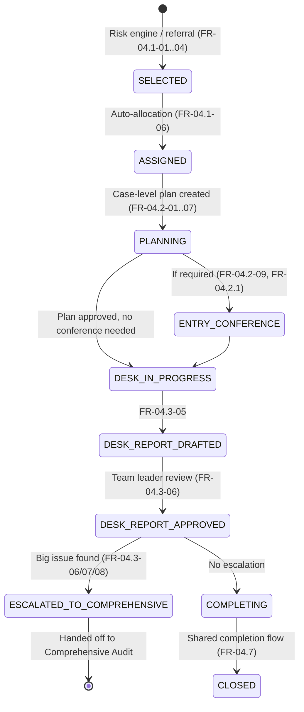

# Desk Audit — Implementation Guide

**Module:** `com.act.audit.desk`
**Source of requirements:** SoR — Module D, Tax Audit — sections *Audit Case Selection & Assignment* (FR‑04.1), *Audit Case Planning and Programming* (FR‑04.2), *Entry Conference with Taxpayer* (FR‑04.2.1), *Desk Audit* (FR‑04.3), and the shared *Audit Completion (for all Audit Types)* (FR‑04.7).
**Reference architecture:** `bs-filing-core-server` (hexagonal / ports‑and‑adapters, event‑driven with transactional outbox). This guide reuses the same package shape, naming conventions, and integration patterns so the audit service can be built and operated the same way the filing service already is.

---

## 1. Purpose & scope

Desk audit is the **lightweight, evidence‑based, mostly-remote** audit type: the auditor works from internal data, taxpayer‑uploaded documents and third‑party data, without requiring an on‑site visit. It is also the **triage layer**: FR‑04.3‑06/07/08 say that if the desk audit turns up a big issue, the case must be able to escalate into a **Comprehensive Audit** (see `02-comprehensive-audit-implementation-guide.md`) without losing any work already captured.

This guide covers everything a squad needs to implement the desk‑audit slice end‑to‑end: domain model, use cases, ports, events, REST surface, DB schema, and the two integration seams (into the shared case lifecycle, and out to Comprehensive Audit).

Out of scope (covered elsewhere / already delivered): case *selection* by the risk engine, generic audit‑plan authoring/approval, and the exit‑conference/assessment‑notice machinery — these are shared platform capabilities described in §2 and reused, not rebuilt, by desk audit.

---

## 2. Where desk audit sits in the shared audit-case lifecycle

The requirements describe one case lifecycle that every audit type (desk, comprehensive, issue, transfer pricing, joint) rides on top of. Mirroring how `bs-filing-core-server` has one `TaxReturn` aggregate used by many downstream use cases, this architecture defines one **`AuditCase`** aggregate (owned by a shared `com.act.audit.core` module) with a `caseType` discriminator. Desk audit is a set of use cases and a state sub‑machine that operate on that shared aggregate.



Desk audit **owns** the `DESK_IN_PROGRESS → DESK_REPORT_APPROVED` transitions and the escalation decision. It **consumes** (does not re-implement):

| Shared capability | FR ref | Provided by |
|---|---|---|
| Risk-based case selection, random-selection sampling, auto-allocation to auditor/team lead | FR‑04.1‑01…07 | `com.act.audit.core` (case selection module) |
| Case-level audit plan (auditor evaluates case, defines evidence/document checklist, sets audit targets, plan approval chain) | FR‑04.2‑01…12 | `com.act.audit.core.planning` |
| Entry conference scheduling, notes, taxpayer sign-off | FR‑04.2.1‑01…05 | `com.act.audit.core.entryconference` |
| Working papers, exit conference, assessment notice, taxpayer acceptance/objection, standard reports | FR‑04.7‑01…42 | `com.act.audit.core.completion` |

This guide therefore only details the `com.act.audit.desk` package; §7 shows exactly how it calls into the shared modules.

---

## 3. Domain model

### 3.1 `AuditCase` (shared aggregate, extended here only where desk-specific)

```java
package com.act.audit.domain.model;

public class AuditCase extends AggregateRoot {
    private final UUID id;
    private final String caseReferenceNumber;
    private final String tin;                      // taxpayer identifier
    private final AuditCaseType caseType;           // DESK, COMPREHENSIVE, ISSUE, TRANSFER_PRICING, JOINT
    private AuditCaseStatus status;                 // enum, see state diagram above
    private String assignedAuditorActorId;
    private String assignedTeamLeaderActorId;
    private RiskProfileSnapshot riskProfileAtSelection;
    private final List<String> riskIndicators;
    private DeskAuditDetail deskDetail;             // null unless caseType == DESK (or was DESK before escalation)
    private UUID escalatedFromCaseId;                // set on the new COMPREHENSIVE case if this desk case escalated
    ...
}
```

### 3.2 `DeskAuditDetail` (value object, embedded on `AuditCase`)

Captures the desk-audit-specific facts so an escalation to Comprehensive Audit can carry them forward instead of re-collecting evidence (FR‑04.3‑07 requires the risk profile to be updated on escalation; nothing in the requirement says evidence should be re-gathered).

```java
package com.act.audit.domain.valueobject;

public record DeskAuditDetail(
    List<EvidenceReference> evidenceGathered,      // FR-04.3-01, internal + 3rd-party sources
    List<UploadedDocumentReference> taxpayerUploads,// FR-04.3-02
    List<AnalyticsRunReference> dataAnalyticsRuns,  // FR-04.3-03 (BI tool output references)
    String draftReportId,                           // FR-04.3-05
    DeskAuditOutcome outcome,                        // NO_ISSUE, MINOR_ISSUE, BIG_ISSUE
    String escalationRecommendationNarrative,        // FR-04.3-06 (team leader's recommendation)
    Boolean comprehensiveAuditRequired               // FR-04.3-08, decided by director/process owner
) {}
```

### 3.3 Domain events (desk-specific)

| Event | Raised when | FR ref |
|---|---|---|
| `DeskAuditEvidenceGatheredEvent` | Evidence pulled from internal/3rd‑party source or taxpayer upload recorded | 04.3‑01/02 |
| `DeskAuditAnalyticsRunEvent` | BI analytics job completes against the case | 04.3‑03 |
| `DeskAuditConductedEvent` | Auditor runs the standard desk-audit procedure over all gathered inputs | 04.3‑04 |
| `DeskAuditReportDraftedEvent` | Draft report submitted to team leader | 04.3‑05 |
| `DeskAuditReportApprovedEvent` | Team leader approves the draft (carries `bigIssueFound` flag) | 04.3‑06 |
| `TaxpayerRiskProfileUpdatedEvent` | Risk profile amended after a big issue is found | 04.3‑07 |
| `DeskAuditEscalatedToComprehensiveEvent` | Director/process owner confirms escalation | 04.3‑08 |
| `DeskAuditReportSentToTaxpayerEvent` | No escalation — report routed to taxpayer via completion flow | 04.3‑06 |

All events follow the existing convention (`DomainEvent` base fields: `eventId`, `occurredAt`, plus payload) and are drained via `pullEvents()` after `save()`, then pushed through `OutboxPort`/`EventPublisherPort` — never published from inside the aggregate, exactly as `bs-filing-core-server`'s `AggregateRoot` javadoc mandates.

---

## 4. Application layer — use cases

One class per action, `application/usecase/deskaudit/`, mirroring `taxreturn/` in the filing service:

| FR ref | Use case class | Responsibility |
|---|---|---|
| 04.3‑01 | `GatherDeskAuditEvidenceUseCase` | Pull evidence from internal systems and third‑party sources via `ThirdPartyDataPort`; append to `DeskAuditDetail.evidenceGathered`. |
| 04.3‑02 | `UploadDeskAuditSupportingDocumentUseCase` | Taxpayer-portal facing; stores document via `DmsPort`, links to case. |
| 04.3‑03 | `RunDeskAuditAnalyticsUseCase` | Calls `DataAnalyticsPort` (BI tool integration), stores a reference (not the raw dataset) on the case. |
| 04.3‑04 | `ConductDeskAuditUseCase` | Orchestrates the standard procedure: reconciles internal data, taxpayer history, third‑party data and uploaded documents; produces findings; requires 04.3‑01…03 to have run first. |
| 04.3‑05 | `DraftDeskAuditReportUseCase` | Auditor produces draft report from findings; transitions case to `DESK_REPORT_DRAFTED`; submits to team leader. |
| 04.3‑06 | `ApproveDeskAuditReportUseCase` | Team leader decision. Two branches: (a) `bigIssueFound = true` → records escalation recommendation, case → `DESK_REPORT_APPROVED` with `comprehensiveAuditRequired = null` pending director call; (b) `bigIssueFound = false` → delegates to shared `SendAuditReportToTaxpayerUseCase` (completion module, FR‑04.7 family). |
| 04.3‑07 | `UpdateTaxpayerRiskProfileFromDeskFindingUseCase` | Invoked only on the big-issue branch; calls `RiskEnginePort` (already exists as `RiskEnginePort.evaluate(...)` in the filing service — extend with an `amendProfile(...)` method) so the change is visible to the risk engine for future case selection. |
| 04.3‑08 | `DecideComprehensiveAuditEscalationUseCase` | Director/process-owner action. Reads configurable escalation criteria (see §6.2), and either (a) opens a new `AuditCase{caseType=COMPREHENSIVE}` seeded from the desk case's `DeskAuditDetail`, publishing `DeskAuditEscalatedToComprehensiveEvent`, and marks the desk case `ESCALATED_TO_COMPREHENSIVE`; or (b) declines escalation and routes the case into the shared completion flow. |

**Escalation hand-off contract** (the key integration point with the Comprehensive Audit guide):

```java
public interface DeskToComprehensiveEscalationPort {
    UUID openComprehensiveCase(EscalationRequest request);

    record EscalationRequest(
        UUID sourceDeskCaseId,
        String tin,
        List<EvidenceReference> carriedEvidence,
        String escalationNarrative,
        String directorActorId
    ) {}
}
```
This is implemented in-process (a direct use-case call, not a remote adapter) since both modules live in the same service — but it is expressed as a port so it can later be split into its own service without touching desk-audit code, exactly the pattern `CaseManagementPort`/`WorkflowEnginePort` use for genuinely-external systems in `bs-filing-core-server`.

---

## 5. Ports & adapters needed

| Port (new, in `application/port`) | Purpose | Adapter (in `engineadapter/`) |
|---|---|---|
| `ThirdPartyDataPort` | Fetch/match third-party data sources for evidence gathering (04.3‑01) and later reconciliation | `engineadapter/thirdpartydata/ThirdPartyDataMockAdapter` initially, real adapters per data source later |
| `DataAnalyticsPort` | Trigger BI analysis jobs and retrieve summarized results (04.3‑03) | `engineadapter/analytics/DataAnalyticsMockAdapter` |
| `DmsPort` | **Reused as-is** from filing service — document storage/retrieval for taxpayer uploads | already exists |
| `RiskEnginePort` (extend) | Add `amendProfile(String tin, RiskProfileAmendment amendment)` alongside the existing `evaluate(...)` | extend `RiskEngineMockAdapter` |
| `WorkflowEnginePort` | **Reused as-is** — draft report → team-leader approval routing | already exists |
| `NotificationEnginePort` | **Reused as-is** — notify taxpayer / team leader of state changes | already exists |

---

## 6. Business rules to make configurable (not hard-code)

1. **Standard desk-audit procedure definition** (FR‑04.3‑04): the checklist of what "conduct desk audit using internal data, taxpayer history, third-party data and uploaded documents following standard audit procedures" means should be a versioned rule/config set (`DeskAuditProcedureDefinition`), analogous to `RulePackageVersion` in `TaxTypeEnginePort` — so procedure changes don't require redeploys.
2. **Escalation criteria** (FR‑04.3‑08: *"system shall allow configuration of criteria to decide on escalating cases to comprehensive audit"*): implement as a rule set evaluated by `RuleEnginePort` (reuse the filing service's rule-engine port/adapter pattern) against `DeskAuditDetail` facts (issue materiality thresholds, industry sector, prior audit history, etc.), producing a recommendation the director can accept/override.

---

## 7. REST surface (`api/controller/DeskAuditController.java`)

| Method & path | Use case | Notes |
|---|---|---|
| `POST /audit-cases/{caseId}/desk/evidence` | `GatherDeskAuditEvidenceUseCase` | internal/officer-facing |
| `POST /portal/audit-cases/{caseId}/desk/documents` | `UploadDeskAuditSupportingDocumentUseCase` | taxpayer-portal facing, multipart upload via DMS |
| `POST /audit-cases/{caseId}/desk/analytics-runs` | `RunDeskAuditAnalyticsUseCase` | |
| `POST /audit-cases/{caseId}/desk/conduct` | `ConductDeskAuditUseCase` | |
| `POST /audit-cases/{caseId}/desk/report` | `DraftDeskAuditReportUseCase` | |
| `PUT  /audit-cases/{caseId}/desk/report/approval` | `ApproveDeskAuditReportUseCase` | body: `{decision, bigIssueFound, narrative}` |
| `POST /audit-cases/{caseId}/desk/escalation` | `DecideComprehensiveAuditEscalationUseCase` | director/process-owner only |

Follow the same `BUC-` traceability convention used in `bs-filing-core-server` (each controller/port/use-case javadoc references a business-use-case ID). Propose: **`BUC-AUD-D01`…`BUC-AUD-D08`** for the eight desk-audit FRs above, so requirement ↔ code ↔ test traceability is preserved the same way `BUC-FIL-xxx` works today.

---

## 8. Persistence (Flyway)

New migration, e.g. `V1__audit_case_and_desk_detail.sql` (in a new `bs-audit-core-server` module, or a new schema in the existing DB if audit is co-deployed):

```sql
CREATE TABLE audit_cases (
    id UUID PRIMARY KEY,
    case_reference_number VARCHAR(64) NOT NULL UNIQUE,
    tin VARCHAR(32) NOT NULL,
    case_type VARCHAR(32) NOT NULL,             -- DESK, COMPREHENSIVE, ISSUE, TRANSFER_PRICING, JOINT
    status VARCHAR(32) NOT NULL,
    assigned_auditor_actor_id VARCHAR(64),
    assigned_team_leader_actor_id VARCHAR(64),
    escalated_from_case_id UUID REFERENCES audit_cases(id),
    created_at TIMESTAMPTZ NOT NULL DEFAULT now(),
    version BIGINT NOT NULL DEFAULT 0
);

CREATE TABLE desk_audit_details (
    audit_case_id UUID PRIMARY KEY REFERENCES audit_cases(id),
    outcome VARCHAR(32),                         -- NO_ISSUE, MINOR_ISSUE, BIG_ISSUE
    draft_report_id UUID,
    escalation_recommendation_narrative TEXT,
    comprehensive_audit_required BOOLEAN
);

CREATE TABLE desk_audit_evidence (
    id UUID PRIMARY KEY,
    audit_case_id UUID NOT NULL REFERENCES audit_cases(id),
    source_type VARCHAR(32) NOT NULL,            -- INTERNAL, THIRD_PARTY, TAXPAYER_UPLOAD
    source_reference VARCHAR(256) NOT NULL,
    gathered_at TIMESTAMPTZ NOT NULL DEFAULT now()
);

CREATE INDEX ix_audit_cases_status ON audit_cases (status);
CREATE INDEX ix_desk_evidence_case ON desk_audit_evidence (audit_case_id);
```

---

## 9. Testing checklist

- Unit tests per use case (mirror `*_UseCaseTest.java` naming under `src/test/.../unit/application/usecase/deskaudit/`).
- Domain test: `AuditCaseTest` — verify illegal transitions are rejected (e.g. cannot approve a report before it's drafted; cannot escalate a case that's already `CLOSED`).
- Sanitization/edge-case fixtures (following the existing `test-data/sanitization/README.md` pattern): oversized evidence descriptions, invalid TIN, future-dated documents, missing required escalation narrative.
- Integration test for the escalation hand-off: assert the new Comprehensive case is seeded with the desk case's evidence and a back-reference (`escalatedFromCaseId`), and that both cases' history is queryable end-to-end (FR‑04.7‑42, history is preserved).

---

## 10. Non-functional notes

- All desk-audit state transitions go through the outbox so downstream consumers (dashboards, reporting per FR‑04.4‑34/04.7‑39 style management reports) are eventually consistent without coupling desk-audit's transaction to reporting infrastructure.
- Third-party data and analytics calls (§5) are exactly the kind of external dependency the filing service isolates behind mock adapters first — do the same here so the domain and use-case layers can be fully unit-tested before real integrations exist.
