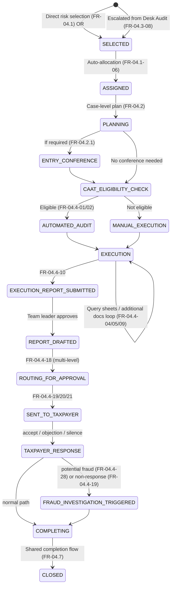

# Comprehensive Audit — Implementation Guide

**Module:** `com.act.audit.comprehensive`
**Source of requirements:** SoR — Module D, Tax Audit — section *Comprehensive Audit* (FR‑04.4‑01…34), plus the shared *Audit Case Selection & Assignment* (FR‑04.1), *Audit Case Planning and Programming* (FR‑04.2), *Entry Conference with Taxpayer* (FR‑04.2.1), and *Audit Completion (for all Audit Types)* (FR‑04.7).
**Reference architecture:** `bs-filing-core-server` (hexagonal / ports‑and‑adapters, event‑driven with transactional outbox).

---

## 1. Purpose & scope

Comprehensive audit is the **deep, full-scope** audit type: CAAT-assisted or manual verification across balance sheet, income statement, cash-flow, equity and multiple tax heads, with sampling, third‑party matching, ratio/benchmark analysis, and multi-level approval before assessment. It is reached two ways:

1. **Direct selection** by the risk engine (FR‑04.1‑01, case type = `comprehensive audit`).
2. **Escalation from Desk Audit** (FR‑04.3‑06…08) — see `01-desk-audit-implementation-guide.md` §4, `DecideComprehensiveAuditEscalationUseCase`.

Both paths converge on the same `AuditCase{caseType=COMPREHENSIVE}` aggregate and the same use cases described below, so this module does not need to know which path a given case came from — it only needs to read `escalatedFromCaseId` when present, to pull forward the desk evidence (FR‑04.3‑07 style continuity).

---

## 2. Where comprehensive audit sits in the shared audit-case lifecycle



Shared platform capabilities consumed (not re-implemented here) are the same as in the desk-audit guide: case selection/assignment (FR‑04.1), case planning (FR‑04.2), entry conference (FR‑04.2.1), and completion/notice/report machinery (FR‑04.7). This guide focuses on the `EXECUTION` sub-machine, which is where comprehensive audit's real complexity lives.

---

## 3. Domain model

### 3.1 `ComprehensiveAuditDetail` (value object, embedded on the shared `AuditCase`)

```java
package com.act.audit.domain.valueobject;

public record ComprehensiveAuditDetail(
    boolean caatEligible,                          // FR-04.4-01
    CaatRunReference caatRun,                       // FR-04.4-02, null if not CAAT-eligible
    List<AssertionVerification> assertions,         // FR-04.4-03: BS, IS, cash flow, equity, ...
    List<QuerySheet> querySheets,                   // FR-04.4-05/09
    List<BenchmarkComparison> benchmarkComparisons, // FR-04.4-06/14
    List<ThirdPartyMatchResult> thirdPartyMatches,   // FR-04.4-07
    List<TestingResult> balanceSheetOrRevenueTests,  // FR-04.4-08
    List<AccountingComplianceAssessment> accountingComplianceChecks, // FR-04.4-11 (IFRS etc.)
    List<AuditTrailRun> auditTrailRuns,              // FR-04.4-12 (ITAS or taxpayer system)
    List<SampleSelection> sampleSelections,          // FR-04.4-13/15/16
    String executionReportId,                        // FR-04.4-10
    String draftReportId,                             // derived after execution report approval
    ApprovalChainState approvalChainState,             // FR-04.4-18
    FraudFlag fraudFlag,                               // FR-04.4-28
    boolean multiZoneConsolidation,                     // FR-04.4-31/32/33
    List<UUID> zoneSubReportIds
) {}
```

### 3.2 Supporting value objects (new)

- `AssertionVerification(assertionType, method, finding)`
- `QuerySheet(id, sentAt, requestedDocuments, taxpayerResponseDueAt, status)`
- `BenchmarkComparison(ratioType, taxpayerValue, industryBenchmark, variance)` — covers input/output ratio, profitability ratio, cost/expense ratio comparisons from FR‑04.4‑14.
- `SampleSelection(populationDescription, sampleCriteria, sampledRecordRefs)`
- `ApprovalChainState(currentLevel, approvalLimitThreshold, history[])`

### 3.3 Domain events (comprehensive-specific)

| Event | Raised when | FR ref |
|---|---|---|
| `CaatEligibilityAssessedEvent` | Eligibility rule evaluated | 04.4‑01 |
| `CaatRunCompletedEvent` | Automated audit tool finishes | 04.4‑02 |
| `AssertionVerifiedEvent` | Each assertion/verification recorded | 04.4‑03 |
| `AdditionalDocumentsRequestedEvent` | Auditor requests more taxpayer docs | 04.4‑04 |
| `QuerySheetSentEvent` / `QuerySheetRespondedEvent` / `QueryDisposedEvent` | Query lifecycle | 04.4‑05, 04.4‑09 |
| `BenchmarkComparisonComputedEvent` | Peer/industry comparison run | 04.4‑06, 04.4‑14 |
| `ThirdPartyDataMatchedEvent` | 3rd‑party matching run | 04.4‑07 |
| `TestingPerformedEvent` | BS/expense/revenue testing recorded | 04.4‑08 |
| `AccountingComplianceAssessedEvent` | IFRS/accounting-method assessment recorded | 04.4‑11 |
| `AuditTrailRunEvent` | Transaction audit-trail executed | 04.4‑12 |
| `SampleSelectedEvent` | Sample drawn for detailed analysis | 04.4‑13/15/16 |
| `ExecutionReportSubmittedEvent` | Auditor submits execution report to team leader | 04.4‑10 |
| `ComprehensiveAuditReportDraftedEvent` | Draft report prepared after execution approval | 04.4‑10 |
| `ComprehensiveAuditReportRoutedEvent` | Enters multi-level approval routing | 04.4‑18 |
| `ComprehensiveAuditReportSentToTaxpayerEvent` | Report sent (portal/email/print) | 04.4‑19/20/21 |
| `ComprehensiveAuditPotentialFraudFlaggedEvent` | Fraud indication found during review | 04.4‑28 |
| `AssessmentNoticeSentEvent` | Notice sent after authorized approval | 04.4‑29 |
| `TaxpayerAcknowledgedReceiptEvent` | e‑signature/electronic confirmation received | 04.4‑30 |
| `MultiZoneAuditConsolidatedEvent` | Multi-zone taxpayer consolidated report generated | 04.4‑31/32/33 |

---

## 4. Application layer — use cases

`application/usecase/comprehensiveaudit/`:

| FR ref | Use case class | Responsibility |
|---|---|---|
| 04.4‑01 | `AssessCaatEligibilityUseCase` | Evaluates configured business rules via `RuleEnginePort`; sets `caatEligible`. |
| 04.4‑02 | `RunCaatUseCase` | Calls `CaatEnginePort` (embedded or interoperating tool) if eligible; records `CaatRunReference`. |
| 04.4‑03 | `RecordAssertionVerificationUseCase` | Auditor records assertion/verification results per financial-statement area. |
| 04.4‑04 | `RequestAdditionalTaxpayerDocumentsUseCase` | Mirrors desk audit's upload flow but scoped to comprehensive; taxpayer uploads via `DmsPort`. |
| 04.4‑05 / 09 | `SendQuerySheetUseCase`, `RecordQuerySheetResponseUseCase`, `DisposeQueryUseCase` | Query-sheet lifecycle with a configurable SLA clock (reuse `WorkflowEnginePort` timers, same pattern as filing's officer-review SLA tracking). |
| 04.4‑06 / 14 | `CompareTaxpayerToBenchmarkUseCase` | Calls `BenchmarkAnalyticsPort` for peer/industry comparison and automatic ratio analysis; flags out-of-pattern results. |
| 04.4‑07 | `RunThirdPartyDataMatchUseCase` | Reuses `ThirdPartyDataPort` from the desk-audit module (shared port, different call site). |
| 04.4‑08 | `PerformBalanceSheetOrRevenueTestingUseCase` | |
| 04.4‑10 | `SubmitExecutionReportUseCase`, then `DraftComprehensiveAuditReportUseCase` on approval | Two-step per the requirement's own wording ("submit... discuss finding. If report is approved... draft the audit report"). |
| 04.4‑11 | `AssessAccountingComplianceUseCase` | Checks taxpayer's accounting/reporting method (e.g., IFRS) compliance. |
| 04.4‑12 | `RunAuditTrailUseCase` | Executes transaction audit trail in ITAS or on imported taxpayer data template. |
| 04.4‑13 / 15 / 16 | `SelectAuditSampleUseCase` (parameterized by scope: general / cost-expense / revenue) | One use case, three invocation contexts, to avoid duplicating sampling logic. |
| 04.4‑17 | *(tooling, not a discrete business action)* — implemented as a `RemoteWorkbenchPort` giving auditors read access to taxpayer ledgers linked via e-invoicing during any of the above use cases; not a separate FR-mapped use case. |
| 04.4‑18 | `RouteReportForApprovalUseCase` | Delegates to `WorkflowEnginePort.startWorkflow("comprehensive-audit-approval", vars)`; approval-limit thresholds drive how many levels are required. |
| 04.4‑19 | `SendReportToTaxpayerForAcceptanceUseCase` | Starts the taxpayer response-window timer; on timeout with no objection, triggers `TriggerFraudInvestigationUseCase` per the requirement's explicit non-response rule. |
| 04.4‑20…27 | *(delegated to the shared FR‑04.7 completion module — identical mechanics to desk-audit's non-escalation report path: alerts, printing, undelivered tracking, letter storage, history, email, taxpayer objection window)* |
| 04.4‑28 | `FlagPotentialFraudUseCase` | Team leader action; calls `CaseManagementPort.openFraudCase(...)` — **this port already exists** in `bs-filing-core-server` and should be reused/shared rather than re-built, since fraud-case opening is identical business behavior across filing and audit. |
| 04.4‑29/30 | `SendAssessmentNoticeUseCase`, `RecordTaxpayerAcknowledgementUseCase` | |
| 04.4‑31/32/33 | `ConsolidateMultiZoneAuditUseCase`, `CalculateAggregateMultiZoneTaxUseCase`, `GenerateSegregatedZoneReportsUseCase` | Region-level consolidation for taxpayers operating across zones. |
| 04.4‑34 | *(reporting, not a use case)* — see §6. |

---

## 5. Ports & adapters needed (new, in addition to what desk audit already defines)

| Port | Purpose | Adapter |
|---|---|---|
| `CaatEnginePort` | Run computer-assisted audit tool/technique | `engineadapter/caat/CaatEngineMockAdapter` |
| `BenchmarkAnalyticsPort` | Industry/peer ratio benchmarking | `engineadapter/analytics/BenchmarkAnalyticsMockAdapter` |
| `RemoteWorkbenchPort` | Remote, read-only access to taxpayer ledgers via e-invoicing links | `engineadapter/einvoice/RemoteWorkbenchAdapter` (extends the filing service's existing `EInvoiceServicePort` integration rather than duplicating it) |
| `ThirdPartyDataPort`, `DmsPort`, `WorkflowEnginePort`, `NotificationEnginePort`, `CaseManagementPort` | **Reused as-is** from the desk-audit / filing-core patterns | already exist |

---

## 6. Reporting (FR‑04.4‑34)

Rather than a use case, implement as a set of **read-model projections** (mirroring `DashboardQueryPort` / `GetFilingDashboardUseCase` in the filing service):

- `AuditCasesCompletedVsPlanProjection` (by tax center/segment)
- `AggregateAssessmentProjection` (principal, penalty, interest — by center/segment/sector)
- `AppealYieldProjection` (assessment reduced via review/appeal/courts, net confirmed amounts)
- `AuditStatusReportProjection`, `AuditorProductivityProjection`, `AssessmentsByCategoryProjection`, `TaxpayerVisitHistoryProjection`, `DisputedAssessmentsProjection`
- A generic `AdHocReportPort` so MoR data-analytics staff can query the underlying schema directly — same idea as the filing service exposing raw query tooling for its own analytics staff.

These projections should be built off the outbox event stream (event‑sourced read models), not by querying the write-side aggregate directly, so reporting load never contends with the transactional audit workflow.

---

## 7. REST surface (`api/controller/ComprehensiveAuditController.java`)

| Method & path | Use case |
|---|---|
| `POST /audit-cases/{caseId}/comprehensive/caat-eligibility` | `AssessCaatEligibilityUseCase` |
| `POST /audit-cases/{caseId}/comprehensive/caat-run` | `RunCaatUseCase` |
| `POST /audit-cases/{caseId}/comprehensive/assertions` | `RecordAssertionVerificationUseCase` |
| `POST /audit-cases/{caseId}/comprehensive/query-sheets` | `SendQuerySheetUseCase` |
| `PUT  /audit-cases/{caseId}/comprehensive/query-sheets/{id}/response` | `RecordQuerySheetResponseUseCase` |
| `POST /audit-cases/{caseId}/comprehensive/benchmark-comparison` | `CompareTaxpayerToBenchmarkUseCase` |
| `POST /audit-cases/{caseId}/comprehensive/third-party-match` | `RunThirdPartyDataMatchUseCase` |
| `POST /audit-cases/{caseId}/comprehensive/samples` | `SelectAuditSampleUseCase` |
| `POST /audit-cases/{caseId}/comprehensive/execution-report` | `SubmitExecutionReportUseCase` |
| `POST /audit-cases/{caseId}/comprehensive/report` | `DraftComprehensiveAuditReportUseCase` |
| `PUT  /audit-cases/{caseId}/comprehensive/report/routing` | `RouteReportForApprovalUseCase` |
| `POST /audit-cases/{caseId}/comprehensive/report/send` | `SendReportToTaxpayerForAcceptanceUseCase` |
| `POST /audit-cases/{caseId}/comprehensive/fraud-flag` | `FlagPotentialFraudUseCase` |
| `POST /audit-cases/{caseId}/comprehensive/multi-zone-consolidation` | `ConsolidateMultiZoneAuditUseCase` |

Proposed BUC codes: **`BUC-AUD-C01`…`BUC-AUD-C21`** (one per FR‑04.4‑01…34, collapsing the reporting/tooling items that aren't discrete use cases, as noted in §4).

---

## 8. Persistence (Flyway)

Adds to the schema started in the desk-audit guide (same `audit_cases` root table):

```sql
CREATE TABLE comprehensive_audit_details (
    audit_case_id UUID PRIMARY KEY REFERENCES audit_cases(id),
    caat_eligible BOOLEAN,
    caat_run_reference VARCHAR(256),
    execution_report_id UUID,
    draft_report_id UUID,
    fraud_flag VARCHAR(32),                 -- NONE, SUSPECTED, CONFIRMED
    multi_zone_consolidation BOOLEAN NOT NULL DEFAULT false
);

CREATE TABLE comprehensive_audit_assertions (
    id UUID PRIMARY KEY,
    audit_case_id UUID NOT NULL REFERENCES audit_cases(id),
    assertion_type VARCHAR(64) NOT NULL,     -- BALANCE_SHEET, INCOME_STATEMENT, CASH_FLOW, EQUITY
    method VARCHAR(128) NOT NULL,
    finding TEXT
);

CREATE TABLE comprehensive_audit_query_sheets (
    id UUID PRIMARY KEY,
    audit_case_id UUID NOT NULL REFERENCES audit_cases(id),
    sent_at TIMESTAMPTZ NOT NULL,
    response_due_at TIMESTAMPTZ NOT NULL,
    status VARCHAR(32) NOT NULL,             -- SENT, RESPONDED, OVERDUE, DISPOSED
    requested_documents TEXT
);

CREATE TABLE comprehensive_audit_samples (
    id UUID PRIMARY KEY,
    audit_case_id UUID NOT NULL REFERENCES audit_cases(id),
    scope VARCHAR(32) NOT NULL,              -- GENERAL, COST_EXPENSE, REVENUE
    population_description TEXT,
    sample_criteria TEXT
);

CREATE TABLE comprehensive_audit_zone_reports (
    id UUID PRIMARY KEY,
    audit_case_id UUID NOT NULL REFERENCES audit_cases(id),
    zone_code VARCHAR(32) NOT NULL,
    report_reference VARCHAR(256) NOT NULL
);

CREATE INDEX ix_query_sheets_status ON comprehensive_audit_query_sheets (status, response_due_at);
```

---

## 9. Testing checklist

- Unit tests per use case under `unit/application/usecase/comprehensiveaudit/`.
- SLA/timer test: query sheet not responded to within the configured window → verify the correct downstream effect (escalation reminder, not silent drop).
- Non-response-to-report test: FR‑04.4‑19's explicit rule that silence triggers fraud investigation — this is easy to under-implement, write it as an explicit scenario test.
- Multi-level approval routing test: verify threshold-based level count matches configuration (FR‑04.4‑18).
- Multi-zone consolidation test: aggregate tax calculation and segregated per-zone reports both produced from one consolidated case (FR‑04.4‑31/32/33).
- Escalation continuity test (paired with the desk-audit guide): a case created via `DecideComprehensiveAuditEscalationUseCase` retains the originating evidence and is fully usable by every comprehensive use case above.

---

## 10. Non-functional notes

- Comprehensive audit is the highest-value, highest-risk workflow in the module — every state transition and every approval-level decision must be append-only/audit-logged (reuse `observability/audit` from the filing service) so the eventual QA review (see `03-quality-assurance-implementation-guide.md`) has a complete, tamper-evident trail to sample against.
- CAAT and benchmark-analytics adapters are natural candidates for async/batch execution (large data volumes); model their ports as request/poll or event-callback rather than synchronous request/response, and drive the resulting domain events through the outbox exactly like the filing service's `PostLedgerValidationHandler` pattern.
