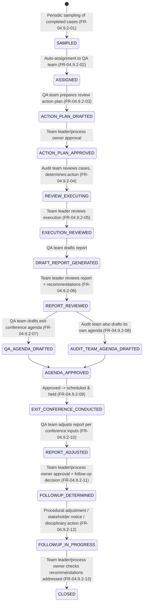

# Audit Quality Assurance — Implementation Guide

**Module:** `com.act.audit.qualityassurance`
**Source of requirements:** SoR — Module D, Tax Audit — section *Conduct Audit Quality Assurance Review* (FR‑04.9.2‑01…13), which sits downstream of, and reads from, *Audit Completion (for all Audit Types)* (FR‑04.7).
**Reference architecture:** `bs-filing-core-server` (hexagonal / ports‑and‑adapters, event‑driven with transactional outbox). The QA review workflow is structurally the closest thing in this whole module to the filing service's existing **Officer Review** flow (`OfficerReviewItem` aggregate + `CreateOfficerReviewItemUseCase` / `AssignOfficerReviewItemUseCase` / `SubmitOfficerDecisionUseCase`), so this guide deliberately reuses that shape rather than inventing a new one.

---

## 1. Purpose & scope

Quality assurance is a **second-pass review layer** that periodically samples *completed* audit cases (of any type — desk, comprehensive, issue, transfer pricing, joint) and checks whether the audit was conducted properly. It is not part of the audit-case lifecycle itself; it is a separate review process that references closed cases, produces its own report and recommendations, and can trigger corrective/disciplinary follow-up.

This guide covers the QA review aggregate, its own approval workflow (review action plan → execution → report → exit conference → follow-up), and its integration points back into the audit-case and officer-management domains.

---

## 2. Process flow



---

## 3. Domain model

### 3.1 `QualityAssuranceReview` (new aggregate — sibling to `OfficerReviewItem`, not a subtype of `AuditCase`)

```java
package com.act.audit.domain.model;

public class QualityAssuranceReview extends AggregateRoot {
    private final UUID id;
    private final UUID sourceAuditCaseId;              // the completed case being reviewed (FK into audit_cases)
    private final SamplingMethod samplingMethod;        // FR-04.9.2-01, configurable
    private QaReviewStatus status;                       // see state diagram
    private String assignedQaTeamMemberActorId;          // FR-04.9.2-02
    private ReviewActionPlan actionPlan;                  // FR-04.9.2-03
    private AuditTeamReviewOutcome auditTeamOutcome;      // FR-04.9.2-04
    private QaReport draftReport;                          // FR-04.9.2-05
    private QaReport adjustedReport;                        // FR-04.9.2-10
    private ExitConferenceAgenda qaAgenda;                   // FR-04.9.2-07
    private ExitConferenceAgenda auditTeamAgenda;             // FR-04.9.2-08
    private ExitConferenceRecord exitConference;               // FR-04.9.2-09
    private FollowUpDecision followUpDecision;                  // FR-04.9.2-11/12
    private boolean recommendationsAddressed;                    // FR-04.9.2-13
    private final Instant createdAt;
    private Long version;
    ...
}
```

**Why a separate aggregate rather than a QA sub-state on `AuditCase`:** the source case is already `CLOSED` by the time QA touches it (FR‑04.9.2‑01 explicitly samples *completed* cases). Reopening/mutating a closed `AuditCase` to hold QA state would violate its own lifecycle invariants. The precedent in `bs-filing-core-server` is exactly this shape: `OfficerReviewItem` references a `taxReturnId` and drives its own decision lifecycle rather than being folded into `TaxReturn`.

### 3.2 Value objects (new)

- `SamplingMethod(strategy, parameters)` — e.g. `RANDOM`, `RISK_WEIGHTED`, `STRATIFIED_BY_CENTER`; strategy and parameters must be configurable per FR‑04.9.2‑01 ("appropriate sampling method/s is/are expected to be configured in the system").
- `ReviewActionPlan(scopeAreas, checklistItems, submittedAt)`
- `AuditTeamReviewOutcome(reviewerActorId, determinedAction, narrative)`
- `QaReport(findings, recommendations, generatedAt)`
- `ExitConferenceAgenda(preparedByActorId, items, submittedAt)`
- `ExitConferenceRecord(scheduledAt, heldAt, notes, attendees)`
- `FollowUpDecision(kind, narrative, decidedByActorId)` where `kind ∈ {PROCEDURAL_ADJUSTMENT, STAKEHOLDER_NOTIFICATION, DISCIPLINARY_ACTION}` — FR‑04.9.2‑12 lists these three explicitly as sub-items (i, ii, iii) of one decision, so model as a **set**, not a single enum, since more than one can apply simultaneously.

### 3.3 Domain events

| Event | Raised when | FR ref |
|---|---|---|
| `AuditCaseSampledForQaEvent` | Periodic sampling selects a case | 04.9.2‑01 |
| `QaReviewAssignedEvent` | Auto-assignment to QA team | 04.9.2‑02 |
| `QaActionPlanSubmittedEvent` / `QaActionPlanApprovedEvent` | Action-plan lifecycle | 04.9.2‑03 |
| `AuditTeamReviewOutcomeRecordedEvent` | Audit team reviews the sampled case | 04.9.2‑04 |
| `QaExecutionApprovedEvent` | Team leader approves execution, triggers draft-report generation | 04.9.2‑05 |
| `QaDraftReportGeneratedEvent` | Draft QA report produced | 04.9.2‑05 |
| `QaReportReviewedEvent` | Team leader/process owner reviews report + recommendations | 04.9.2‑06 |
| `QaExitConferenceAgendaSubmittedEvent` (×2 — QA team and audit team variants) | Agenda drafting | 04.9.2‑07/08 |
| `QaExitConferenceAgendaApprovedEvent` | Approval, triggers scheduling | 04.9.2‑09 |
| `QaExitConferenceConductedEvent` | Conference held | 04.9.2‑09 |
| `QaReportAdjustedEvent` | Report adjusted from conference inputs | 04.9.2‑10 |
| `QaFollowUpDeterminedEvent` | Follow-up action decided | 04.9.2‑11 |
| `QaProceduralAdjustmentMadeEvent`, `QaStakeholderNotifiedEvent`, `QaDisciplinaryActionTakenEvent` | One or more fire based on `FollowUpDecision.kind` set | 04.9.2‑12 |
| `QaRecommendationsComplianceCheckedEvent` | Closure check | 04.9.2‑13 |

---

## 4. Application layer — use cases

`application/usecase/qualityassurance/`, one class per FR line to keep the audit trail 1:1 with the requirement (same granularity the filing service uses):

| FR ref | Use case class |
|---|---|
| 04.9.2‑01 | `SampleAuditCasesForQaUseCase` — scheduled job (mirrors `OpenFilingPeriodJob`'s `@Scheduled` pattern), pulls `CLOSED` cases via `AuditCaseRepositoryPort` and applies the configured `SamplingMethod`. |
| 04.9.2‑02 | `AssignQaReviewUseCase` — auto-assignment by predefined criteria; mirrors `application/usecase/officer/AssignOfficerReviewItemUseCase` almost 1:1. |
| 04.9.2‑03 | `SubmitQaActionPlanUseCase`, `ApproveQaActionPlanUseCase` |
| 04.9.2‑04 | `RecordAuditTeamReviewOutcomeUseCase` |
| 04.9.2‑05 | `ApproveQaExecutionUseCase` (on approval, triggers) → `GenerateQaDraftReportUseCase`. Note the requirement also folds in a second auto-allocation rule for QA cases here — implement `AssignQaReviewUseCase` (04.9.2‑02) as the single allocation entry point, invoked at both the initial-sampling and, if needed, the execution-review stage, rather than duplicating allocation logic. |
| 04.9.2‑06 | `ReviewQaReportUseCase` |
| 04.9.2‑07 | `SubmitQaExitConferenceAgendaUseCase` (QA-team variant) |
| 04.9.2‑08 | `SubmitAuditTeamExitConferenceAgendaUseCase` |
| 04.9.2‑09 | `ApproveQaExitConferenceAgendaUseCase` → on approval, `ScheduleQaExitConferenceUseCase` (delegates to the shared entry/exit-conference scheduling capability used elsewhere in the module, e.g. `WorkflowEnginePort`/`NotificationEnginePort`, same as FR‑04.2.1 and FR‑04.7‑04). |
| 04.9.2‑10 | `AdjustQaReportFromConferenceUseCase` |
| 04.9.2‑11 | `DetermineQaFollowUpUseCase` |
| 04.9.2‑12 | `ApplyQaProceduralAdjustmentUseCase`, `NotifyQaStakeholdersUseCase`, `RecordQaDisciplinaryActionUseCase` — three independent use cases invoked according to which `FollowUpDecision.kind` values are set; `DetermineQaFollowUpUseCase` orchestrates which of the three fire. |
| 04.9.2‑13 | `CheckQaRecommendationsAddressedUseCase` — closes the review; if not addressed, re-opens `FOLLOWUP_IN_PROGRESS` rather than closing (the requirement only says "check whether... or not" — model both outcomes explicitly rather than assuming compliance). |

Example, following the exact style of `SubmitOfficerDecisionUseCase`:

```java
package com.act.audit.application.usecase.qualityassurance;

@Service
@RequiredArgsConstructor
public class DetermineQaFollowUpUseCase {

    private final QualityAssuranceReviewRepositoryPort reviews;
    private final EventPublisherPort eventPublisher;
    private final ApplyQaProceduralAdjustmentUseCase applyProceduralAdjustment;
    private final NotifyQaStakeholdersUseCase notifyStakeholders;
    private final RecordQaDisciplinaryActionUseCase recordDisciplinaryAction;

    @Transactional
    public QualityAssuranceReview execute(UUID reviewId, FollowUpDecision decision) {
        QualityAssuranceReview review = reviews.findById(reviewId)
            .orElseThrow(() -> new ResourceNotFoundException("qa review not found: " + reviewId));
        review.determineFollowUp(decision);
        QualityAssuranceReview saved = reviews.save(review);
        saved.pullEvents().forEach(eventPublisher::publish);

        if (decision.kinds().contains(FollowUpKind.PROCEDURAL_ADJUSTMENT)) {
            applyProceduralAdjustment.execute(reviewId, decision);
        }
        if (decision.kinds().contains(FollowUpKind.STAKEHOLDER_NOTIFICATION)) {
            notifyStakeholders.execute(reviewId, decision);
        }
        if (decision.kinds().contains(FollowUpKind.DISCIPLINARY_ACTION)) {
            recordDisciplinaryAction.execute(reviewId, decision);
        }
        return saved;
    }
}
```

---

## 5. Ports & adapters

| Port | Purpose | Notes |
|---|---|---|
| `AuditCaseRepositoryPort` (read access) | Read completed `AuditCase` records to sample from and to attach QA history/history-of-audit-actions views | already defined by the core audit module (desk/comprehensive guides); QA only needs read access, never writes to `AuditCase` |
| `QualityAssuranceReviewRepositoryPort` | Persistence for the new aggregate | new, `persistence/adapter/QualityAssuranceReviewRepositoryAdapter` (JPA), same pattern as `OfficerReviewItemRepositoryPort`/its adapter |
| `WorkflowEnginePort`, `NotificationEnginePort` | **Reused as-is** — conference scheduling, alerts | already exist |
| `DisciplinaryActionPort` | Records/forwards disciplinary action against an auditor/team leader — likely delegates to an HR system | new; `engineadapter/disciplinary/DisciplinaryActionMockAdapter` initially |
| `CaseManagementPort` | If QA review uncovers something requiring a formal case rather than a simple stakeholder notice, reuse the existing `openCaseFromError`-style path | already exists |

---

## 6. Cross-module integration points

1. **Sampling reads, never writes, `AuditCase`.** `SampleAuditCasesForQaUseCase` depends only on the read side of the core audit module (status = `CLOSED`), so this module can be deployed and iterated independently of desk/comprehensive audit changes.
2. **QA outcomes should be visible on the source case's history** (FR‑04.7‑42 requires a full case history accessible by authorization) — implement as a read-model join (`AuditCaseHistoryProjection` includes linked `QualityAssuranceReview` summaries), not a foreign-key write back into `audit_cases`.
3. **Auto-allocation** (04.9.2‑02/05) uses the same criteria shape as `AuditCase` allocation (FR‑04.1‑06: expertise, sector, skills, seniority, complexity, workload) — factor this into a single shared `AllocationRulesPort` used by both the core audit-assignment flow and QA, instead of maintaining two independent rule sets that will drift.
4. **Disciplinary action** (04.9.2‑12‑iii) is the one place this module reaches outside the audit domain entirely — keep it behind a port so HR/personnel-system integration specifics never leak into `com.act.audit.qualityassurance`.

---

## 7. REST surface (`api/controller/QualityAssuranceController.java`)

| Method & path | Use case |
|---|---|
| `GET  /qa-reviews` | list/queue view (mirrors `ListOfficerReviewQueueUseCase`) |
| `POST /qa-reviews/{id}/assignment` | `AssignQaReviewUseCase` |
| `POST /qa-reviews/{id}/action-plan` | `SubmitQaActionPlanUseCase` |
| `PUT  /qa-reviews/{id}/action-plan/approval` | `ApproveQaActionPlanUseCase` |
| `POST /qa-reviews/{id}/audit-team-outcome` | `RecordAuditTeamReviewOutcomeUseCase` |
| `PUT  /qa-reviews/{id}/execution/approval` | `ApproveQaExecutionUseCase` |
| `PUT  /qa-reviews/{id}/report/review` | `ReviewQaReportUseCase` |
| `POST /qa-reviews/{id}/exit-conference/agenda/qa-team` | `SubmitQaExitConferenceAgendaUseCase` |
| `POST /qa-reviews/{id}/exit-conference/agenda/audit-team` | `SubmitAuditTeamExitConferenceAgendaUseCase` |
| `PUT  /qa-reviews/{id}/exit-conference/agenda/approval` | `ApproveQaExitConferenceAgendaUseCase` |
| `POST /qa-reviews/{id}/exit-conference/conduct` | conducted-flag + notes |
| `PUT  /qa-reviews/{id}/report/adjustment` | `AdjustQaReportFromConferenceUseCase` |
| `PUT  /qa-reviews/{id}/follow-up` | `DetermineQaFollowUpUseCase` |
| `PUT  /qa-reviews/{id}/closure-check` | `CheckQaRecommendationsAddressedUseCase` |

Proposed BUC codes: **`BUC-AUD-Q01`…`BUC-AUD-Q13`**, one per FR‑04.9.2‑01…13.

---

## 8. Persistence (Flyway)

```sql
CREATE TABLE quality_assurance_reviews (
    id UUID PRIMARY KEY,
    source_audit_case_id UUID NOT NULL REFERENCES audit_cases(id),
    sampling_strategy VARCHAR(32) NOT NULL,
    status VARCHAR(32) NOT NULL,
    assigned_qa_actor_id VARCHAR(64),
    recommendations_addressed BOOLEAN,
    created_at TIMESTAMPTZ NOT NULL DEFAULT now(),
    version BIGINT NOT NULL DEFAULT 0
);

CREATE TABLE qa_action_plans (
    qa_review_id UUID PRIMARY KEY REFERENCES quality_assurance_reviews(id),
    checklist_items JSONB NOT NULL,
    submitted_at TIMESTAMPTZ,
    approved_at TIMESTAMPTZ
);

CREATE TABLE qa_reports (
    id UUID PRIMARY KEY,
    qa_review_id UUID NOT NULL REFERENCES quality_assurance_reviews(id),
    kind VARCHAR(16) NOT NULL,               -- DRAFT, ADJUSTED
    findings TEXT,
    recommendations TEXT,
    generated_at TIMESTAMPTZ NOT NULL DEFAULT now()
);

CREATE TABLE qa_exit_conferences (
    qa_review_id UUID PRIMARY KEY REFERENCES quality_assurance_reviews(id),
    qa_team_agenda JSONB,
    audit_team_agenda JSONB,
    agenda_approved_at TIMESTAMPTZ,
    scheduled_at TIMESTAMPTZ,
    held_at TIMESTAMPTZ,
    notes TEXT
);

CREATE TABLE qa_follow_up_actions (
    id UUID PRIMARY KEY,
    qa_review_id UUID NOT NULL REFERENCES quality_assurance_reviews(id),
    kind VARCHAR(32) NOT NULL,               -- PROCEDURAL_ADJUSTMENT, STAKEHOLDER_NOTIFICATION, DISCIPLINARY_ACTION
    narrative TEXT,
    decided_by_actor_id VARCHAR(64),
    decided_at TIMESTAMPTZ NOT NULL DEFAULT now()
);

CREATE INDEX ix_qa_reviews_status ON quality_assurance_reviews (status);
CREATE INDEX ix_qa_reviews_source_case ON quality_assurance_reviews (source_audit_case_id);
```

---

## 9. Testing checklist

- Unit tests per use case under `unit/application/usecase/qualityassurance/`.
- Sampling test: configurable strategy actually changes which cases are pulled (random vs. risk-weighted vs. stratified) — don't let one strategy be hard-coded as a default with the others unimplemented.
- Multi-kind follow-up test: a `FollowUpDecision` with more than one `kind` fires all three corresponding use cases exactly once each (FR‑04.9.2‑12 explicitly allows i, ii, and iii together).
- Closure loop test: `CheckQaRecommendationsAddressedUseCase` returning "not addressed" must **not** close the review — assert it stays in `FOLLOWUP_IN_PROGRESS` and is re-surfaced to the team leader/process owner.
- Cross-aggregate integration test: confirm `AuditCase` is never mutated by any QA use case (read-only access enforced at the port level, not just by convention).

---

## 10. Non-functional notes

- Because QA reviews the integrity of the rest of the module, every QA-side action should itself be captured in the append-only audit log (`observability/audit`), and QA's own dashboards/reports should be excluded from being sampled by QA (avoid a self-referential loop).
- Treat the periodic sampling job (04.9.2‑01) as idempotent and safe to re-run (use the existing `IdempotencyStorePort` pattern from the filing service) so a scheduler retry never double-samples the same case into two open reviews.
