# Tax Audit Service — Refined Scope & Architecture

## 1. Purpose of This Refined Scope

The original Tax Audit BRS (OT/AS/001) contains **24 business use cases** (BUC-TA-001 through BUC-TA-024) covering the complete audit lifecycle. The SoR (Module D) supplies the functional detail underneath those BUCs (FR-04.0–FR-04.10). The Issue Audit functional requirements (FR-04.6-01 – FR-04.6-07) introduce a targeted, issue-specific investigation sub-process and add **1 new BUC**, bringing the total to **25 BUCs**.

This document maps all 25 BUCs into the ITAS ecosystem using the same decomposition rules as registration-service:

- **Core audit lifecycle** stays in `bs-taxaudit-core-server`
- **Legal/rule configurations** go to `tax-type-engine` / `rule-engine`
- **Document production** goes to `dms`
- **Notifications** go to `notification-engine`
- **Risk scoring & profiling** go to `risk-engine`
- **Workflow orchestration** goes to `workflow-engine`
- **Ledger accounting** goes to `ledger-engine`
- **Case management (disputes)** goes to `case-management-service`
- **Fraud investigation** goes to `audit-service` (fraud sub-module)
- **Auditor capacity & targets** go to `workforce-engine` *(v2 — see Rule 14)*
- **Management reporting & KPIs** go to `reporting-service`, fed entirely by domain events *(v2 — see Rule 17)*

---

## 2. Channels & Triggers

Before walking through the clusters, it's worth laying out **who actually talks to this service, and how** — because the same case moves through four very different front doors depending on the stage of the audit and who's holding the pen at that moment.

The service is reached through four request-bearing channels plus one that isn't a "channel" so much as time itself catching up with a case:

- **Back-Office UI** — this is the workhorse channel. Everyone internal to the tax authority — the Audit Team drafting the annual plan, the Director and Senior Management approving it, the Process Owner selecting and prioritizing cases, Auditors and Team Leaders running the actual audits, and the QA Team sampling closed cases — comes through here. It covers the large majority of BUCs: planning (TA-001–TA-005), execution and TP (TA-008–TA-011, TA-013–TA-016), assessment/conclusion (TA-018), QA and fraud triggering (TA-023, TA-024), and the entire Issue Audit workflow (TA-025) from notice through director decision.
- **Joint Audit Workspace** — a narrower channel reserved for cases that cross authority boundaries. The Joint Audit Committee and participating authorities' teams use this for team formation, joint planning, and the shared-workspace execution and finalization steps (TA-006, TA-007, TA-021, TA-022). It's kept separate from the general Back-Office channel because it needs federated trust between authorities, not just internal SSO.
- **Taxpayer Portal** — the only channel the taxpayer or their representative touches directly. It carries notice delivery and acknowledgement, entry conference scheduling/confirmation, general document upload, and — new in this scope — Issue Audit notice viewing/acknowledgement plus scope-gated evidence upload (TA-017, TA-019, TA-020, and the taxpayer-facing half of TA-025).
- **Webhook / External Systems** — inbound pushes rather than a UI. Banks, Customs, MoTRI, other directorates submitting referrals, and external stakeholders land here, feeding case sourcing (TA-002) and the evidence-gathering steps of desk, comprehensive, and TP audits (TA-009, TA-010, TA-014).
- **System-Triggered / Scheduled** — nobody is "logged in" for this one; it's the service reacting to its own clocks and rules. This is where the Issue Audit SLA timer on `NOTICE_ISSUED` lives, where the revision-cap auto-escalation fires once `maxRevisionCount` is exceeded, where fraud auto-escalation kicks in on pattern match (TA-024), and where QA case sampling pulls its pool (TA-023).

| Channel | Who initiates | Authentication | Typical BUCs |
|---|---|---|---|
| **Back-Office UI** | Audit Team, Director, Senior Management, Process Owner, Auditor, Team Leader, QA Team | Officer SSO | TA-001–TA-005, TA-008–TA-011, TA-013–TA-016, TA-018, TA-023–TA-025 |
| **Joint Audit Workspace** | Joint Audit Committee, participating authorities' teams | Mutual TLS + federated SSO | TA-006, TA-007, TA-021, TA-022 |
| **Taxpayer Portal** | Taxpayer, Tax Agent/Representative | NID/OTP or shared portal session (registration-service) | TA-017, TA-019, TA-020, TA-025 (notice acknowledgement + scoped document upload) |
| **Webhook / External Systems** | Banks, Customs, MoTRI, other directorates, external stakeholders (referrals) | mTLS / Internal SA | TA-002 (referral intake), TA-009, TA-010, TA-014 |
| **System-Triggered / Scheduled** | risk-engine, rule-engine, workflow-engine SLA timers | Internal SA | Issue Audit notice SLA expiry (TA-025), revision-cap auto-escalation (TA-025), fraud auto-escalation (TA-024), QA case sampling (TA-023) |

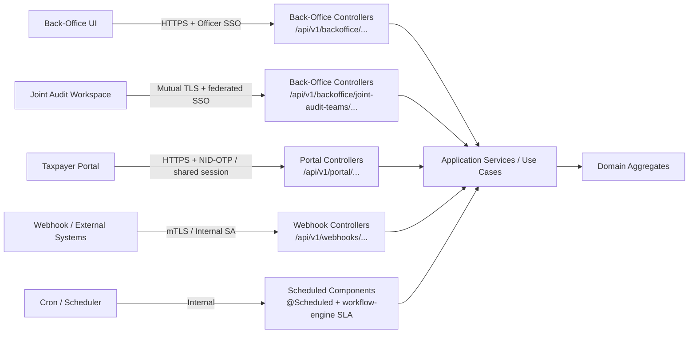

A quick way to read this: the Back-Office UI and the System-Triggered path are really two sides of the same coin for Issue Audit specifically — a human drives the case forward through notice, scope, evidence, and review, but the moment a timer or a revision count is breached, control shifts to the scheduler without anyone clicking anything. That handoff is deliberate (see Rule 20 and Rule 8 in §7) and it's the reason "System-Triggered / Scheduled" earns its own row instead of being folded into Back-Office.

---

## 3. Tax Audit BUC Clustering (25 BUCs → 9 Clusters)

| Cluster | Theme | BUCs | Count | Owner |
|:---|:---|:---|:---:|:---|
| **AP** | Audit Planning & Setup | TA-001, TA-002, TA-003, TA-004, TA-005, TA-006, TA-007 | 7 | **bs-taxaudit-core-server** |
| **EX** | Audit Execution (Desk & Comprehensive) | TA-009, TA-010 | 2 | **bs-taxaudit-core-server** |
| **TP** | Transfer Pricing Audit | TA-012, TA-013, TA-014, TA-015, TA-016 | 5 | **bs-taxaudit-core-server** |
| **JA** | Joint Audit | TA-008, TA-021, TA-022 | 3 | **bs-taxaudit-core-server** |
| **CM** | Communication & Taxpayer Portal | TA-017, TA-019, TA-020 | 3 | **bs-taxaudit-core-server** (orchestration) + notification-engine + portal |
| **RF** | Reporting & Finalization | TA-011, TA-018 | 2 | **bs-taxaudit-core-server** |
| **QA** | Quality Assurance & Oversight | TA-023, TA-024 | 2 | **bs-taxaudit-core-server** |
| **IA** | Issue Audit *(new in v3)* | TA-025, | 1 | **bs-taxaudit-core-server** |
| **TOTAL** | | | **25** | |

> All 25 BUCs are confirmed present and accounted for. The clustering for TA-001 through TA-024 is unchanged from v2; Cluster IA is net-new in v3.

---

## 4. Architecture Overview

### 4.1 Service Context Diagram

```mermaid
graph TB
    subgraph "Channels"
        Portal[Taxpayer Portal]
        BackOffice[Back-Office UI<br/>Auditors / Team Leaders / Directors / Process Owners]
        ExtSys[External Systems<br/>Banks, Customs, MoTRI]
        ReferralSrc[Other Directorates /<br/>External Stakeholders<br/>Audit Referral Requests]
    end

    subgraph "bs-taxaudit-core-server"
        TAXAUDIT[Tax Audit Service<br/>planning + execution + reporting + issue audit]
    end

    subgraph "Engines"
        RiskE[risk-engine<br/>risk scoring & profiling]
        LedgerE[ledger-engine<br/>subledger queries]
        RuleE[rule-engine<br/>audit procedures & thresholds<br/>IA revision cap & SLA config]
        WorkflowE[workflow-engine<br/>approval workflows & SLA<br/>IA SLA timers]
        DmsE[dms<br/>document render & sign]
        NotifE[notification-engine<br/>email / SMS / portal]
        IntegE[integration-engine<br/>3rd party data: banks, customs]
        TaxTypeE[tax-type-engine<br/>taxpayer data & benchmarks]
        WorkforceE[workforce-engine<br/>auditor capacity & targets]
    end

    subgraph "Sibling Services"
        CMS[case-management-service<br/>taxpayer disputes & cases]
        RegS[registration-service<br/>taxpayer identity & TIN]
        AuditFraud[audit-service<br/>fraud investigation sub-module]
        ReportingS[reporting-service<br/>KPIs & management reports]
    end

    Portal --> TAXAUDIT
    BackOffice --> TAXAUDIT
    ExtSys -.-> IntegE
    ReferralSrc -->|audit referral| TAXAUDIT

    TAXAUDIT -->|risk query + profiling| RiskE
    TAXAUDIT -->|subledger read| LedgerE
    TAXAUDIT -->|audit rules + CAAT eligibility + IA config| RuleE
    TAXAUDIT -->|approval flow + IA SLA timers| WorkflowE
    TAXAUDIT -->|cert/render| DmsE
    TAXAUDIT -->|notify| NotifE
    TAXAUDIT -->|3rd party data| IntegE
    TAXAUDIT -->|taxpayer profile| TaxTypeE
    TAXAUDIT -->|capacity + target check| WorkforceE

    TAXAUDIT -.->|RegistrationApproved| RegS
    TAXAUDIT -.->|FraudDetected / FraudEscalatedFromIssueAudit| AuditFraud
    TAXAUDIT -.->|ObjectionRaised| CMS
    TAXAUDIT -.->|KPI events| ReportingS

    classDef service fill:#1e88e5,stroke:#0d47a1,color:#fff
    classDef engine fill:#43a047,stroke:#1b5e20,color:#fff
    classDef sibling fill:#fb8c00,stroke:#e65100,color:#fff
    classDef channel fill:#8e24aa,stroke:#4a148c,color:#fff

    class TAXAUDIT service
    class RiskE,LedgerE,RuleE,WorkflowE,DmsE,NotifE,IntegE,TaxTypeE,WorkforceE engine
    class CMS,RegS,AuditFraud,ReportingS sibling
    class Portal,BackOffice,ExtSys,ReferralSrc channel
```

### 4.1.1 Tax Audit Service — Hexagonal Architecture

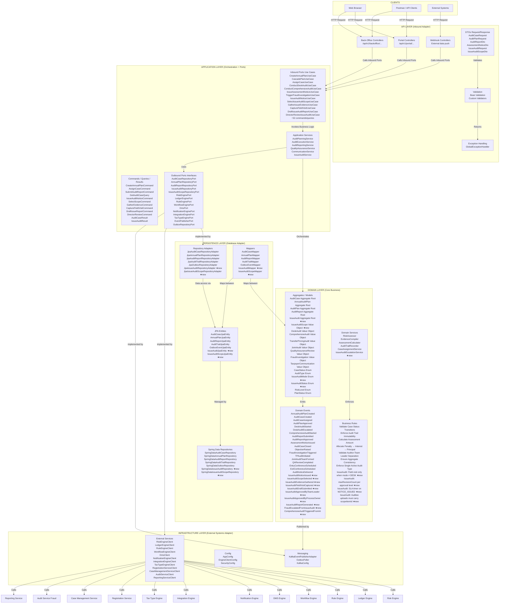

---

### 4.2 Hexagonal Layers Inside bs-taxaudit-core-server

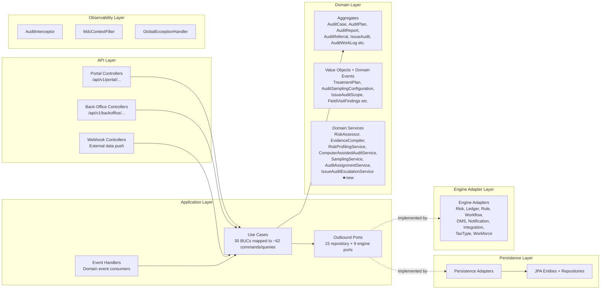

---

## 5. Aggregate Design (Tax Audit Domain)

> **additions:** `AuditReferral` and `AuditWorkLog` are full aggregates. `TreatmentPlan` and `AuditSamplingConfiguration` are value objects embedded on `AuditCase`/`AuditPlan`. Auditor targets and KPI snapshots are delegated to `workforce-engine` and `reporting-service` respectively.
>
> ** additions:** `IssueAudit` is a new aggregate root linked to its parent `AuditCase` via `auditCaseId`. `IssueAuditScope` is a value object capturing each selected noncompliance area — all auditee document uploads must reference a `scopeItemId` from this list. `FieldVisitFindings` is a value object embedded on `IssueAudit`.

```mermaid
classDiagram
    class AnnualAuditPlan {
        UUID id
        int year
        PlanStatus status
        List~AuditCase~ cases
        int totalCasesPlanned
        int totalCasesCreated
        UUID directorId
        UUID seniorManagementId
        List~PlanVersion~ versions
    }

    class AuditReferral {
        UUID id
        AuditCaseSource sourceType
        String referringEntity
        String referenceDetails
        String relatedTaxpayerTin
        ReferralStatus status
        UUID resolvedCaseId
    }

    class AuditCase {
        UUID id
        String caseReferenceNumber
        CaseStatus status
        UUID taxpayerPartyId
        String tin
        UUID assignedAuditorId
        UUID teamLeaderId
        AuditType auditType
        RiskLevel riskLevel
        AuditCaseSource source
        UUID sourceReferralId
        TreatmentPlan treatmentPlan
        UUID annualPlanId
        LocalDate tentativeStartDate
        LocalDate tentativeEndDate
        List~CaseNote~ notes
        List~Evidence~ evidence
    }

    class TreatmentPlan {
        <<ValueObject>>
        TreatmentPlanType planType
        String recommendedActions
        LocalDate targetCompletionDate
        ComplexityRating complexityRating
    }

    class AuditWorkLog {
        UUID id
        UUID auditCaseId
        UUID auditorId
        LocalDate workDate
        BigDecimal hoursLogged
        String activityDescription
        int percentCaseComplete
    }

    class AuditPlan {
        UUID id
        UUID auditCaseId
        PlanStatus status
        String scope
        String materiality
        AuditSamplingConfiguration samplingConfiguration
        List~RiskArea~ riskAreas
        UUID approvedByTeamLeaderId
        List~PlanVersion~ versions
    }

    class AuditSamplingConfiguration {
        <<ValueObject>>
        SamplingMethodType method
        Map~String,String~ parameters
        int sampleSize
        BigDecimal confidenceLevel
    }

    class DeskAudit {
        UUID id
        UUID auditCaseId
        DeskAuditStatus status
        List~Evidence~ internalEvidence
        List~Evidence~ externalEvidence
        String draftReport
        boolean escalatedToComprehensive
    }

    class ComprehensiveAudit {
        UUID id
        UUID auditCaseId
        ComprehensiveStatus status
        boolean caatEligible
        List~TransactionTest~ transactionTests
        List~UUID~ taxpayerZoneIds
        boolean isMultiZoneConsolidated
        String consolidatedTaxCalculation
        String auditExecutionReport
        String draftAuditReport
    }

    class TransferPricingAudit {
        UUID id
        UUID auditCaseId
        TPAuditStatus status
        List~RelatedPartyTransaction~ transactions
        TPMethod selectedMethod
        String benchmarkingAnalysis
        String tpAuditReport
    }

    class JointAudit {
        UUID id
        UUID auditCaseId
        JointAuditStatus status
        List~UUID~ participatingAuthorityIds
        UUID jointAuditCommitteeId
        UUID teamLeaderId
        String sharedWorkspaceId
        String consolidatedReport
    }

    class AuditReport {
        UUID id
        UUID auditCaseId
        ReportStatus status
        String findings
        String conclusions
        List~Approval~ approvals
        UUID finalApproverId
        LocalDate issuedDate
        String assessmentNoticeId
    }

    class QualityAssuranceReview {
        UUID id
        UUID auditCaseId
        UUID qaTeamMemberId
        QAStatus status
        String findings
        List~Recommendation~ recommendations
        List~FollowUpAction~ followUps
        boolean recommendationsImplemented
    }

    class FraudInvestigation {
        UUID id
        UUID auditCaseId
        FraudStatus status
        String indicators
        String evidence
        UUID investigationTeamId
    }

    class TaxpayerCommunication {
        UUID id
        UUID auditCaseId
        CommunicationType type
        String content
        DeliveryStatus deliveryStatus
        LocalDate sentDate
        LocalDate responseDeadline
    }

    class IssueAudit {
        UUID id
        UUID auditCaseId
        IssueAuditStatus status
        IssueAuditMode auditMode
        String noticeDocumentId
        LocalDate noticeIssuedDate
        LocalDate auditeeResponseDeadline
        List~IssueAuditScope~ selectedScopes
        List~Evidence~ internalEvidence
        List~Evidence~ thirdPartyEvidence
        List~Evidence~ auditeeUploadedEvidence
        FieldVisitFindings fieldVisitFindings
        String draftReportContent
        int teamLeaderRevisionCount
        int processOwnerRevisionCount
        String teamLeaderComments
        String processOwnerComments
        String directorOutcome
        String finalReportDocumentId
        LocalDate reportGeneratedDate
    }

    class IssueAuditScope {
        <<ValueObject>>
        UUID id
        UUID issueAuditId
        String scopeItemId
        NoncompliantArea noncomplianceArea
        String taxType
        LocalDate periodFrom
        LocalDate periodTo
        String description
    }

    AuditReferral "0..1" --> "0..1" AuditCase : resolves to
    AnnualAuditPlan "1" --> "0..*" AuditCase : contains
    AuditCase "1" --> "0..*" AuditWorkLog : logs progress via
    AuditCase "1" --> "0..1" AuditPlan : has
    AuditCase "1" --> "0..1" DeskAudit : may have
    AuditCase "1" --> "0..1" ComprehensiveAudit : may have
    AuditCase "1" --> "0..1" TransferPricingAudit : may have
    AuditCase "1" --> "0..1" JointAudit : may have
    AuditCase "1" --> "0..1" AuditReport : produces
    AuditCase "1" --> "0..1" QualityAssuranceReview : may have
    AuditCase "1" --> "0..1" FraudInvestigation : may trigger
    AuditCase "1" --> "0..*" TaxpayerCommunication : tracks
    AuditCase "1" --> "0..1" IssueAudit : may have
    IssueAudit "1" --> "1..*" IssueAuditScope : scopes
```

---

## 6. Cluster-by-Cluster BUC Mapping

### Cluster AP — Audit Planning & Setup (7 BUCs)

| BUC | Name | Description | Aggregate | Key Engine Calls |
|:---|:---|:---|:---|:---|
| **TA-001** | Create and Approve Annual Audit Plan | Audit team prepares annual plan; Director reviews; business units feedback; Senior Management approves | `AnnualAuditPlan` | workflow-engine (approval chain), risk-engine (capacity vs effort) |
| **TA-002** | Cascade Audit Plan to Case Level & Intake Referrals | Break approved plan into individual cases with unique refs; intake and resolve cases sourced from internal/external referrals, not only risk-engine output | `AuditCase`, `AuditReferral` | registration-service (taxpayer lookup), risk-engine (risk scores) |
| **TA-003** | Select and Prioritize Audit Cases | Process Owner reviews a pool blended from risk-ranked, randomly/stratified-sampled, referred, and manually-nominated cases; fits within capacity; attaches a treatment plan per selected case | `AuditCase`, `TreatmentPlan` (VO) | risk-engine (ranking), SamplingService (random/stratified draws), workflow-engine (capacity check) |
| **TA-004** | Assign Cases to Auditors | Auto-assignment by skills/workload/location, checked against auditor targets; Team Leader can override | `AuditCase` | rule-engine (matching rules), workforce-engine (capacity/target check), notification-engine (assignment alert) |
| **TA-005** | Plan Individual Audit Case | Auditor reviews data, determines focus, selects a sampling configuration, researches industry, prepares plan for Team Leader approval | `AuditPlan`, `AuditSamplingConfiguration` (VO) | tax-type-engine (industry benchmarks), integration-engine (3rd party data) |
| **TA-006** | Select and Form Joint Audit Team | Joint Audit Committee reviews referred/risk-flagged cases for cross-authority relevance; performs detailed risk assessment; forms team and assigns Team Leader | `JointAudit` | risk-engine (complexity scoring), workflow-engine (committee approval) |
| **TA-007** | Plan Joint Audit | Team collaboratively prepares detailed plan for Committee approval | `JointAudit` | Same as TA-005 + shared workspace coordination |

**State Machine: AnnualAuditPlan**

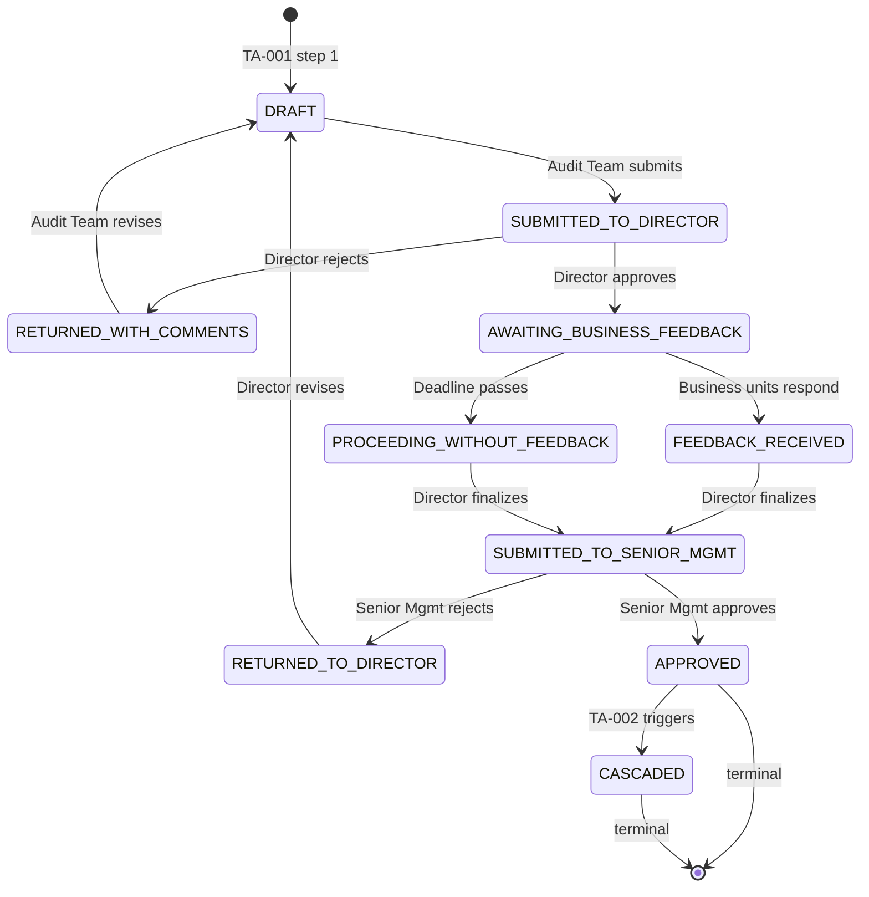

**State Machine: AuditReferral**

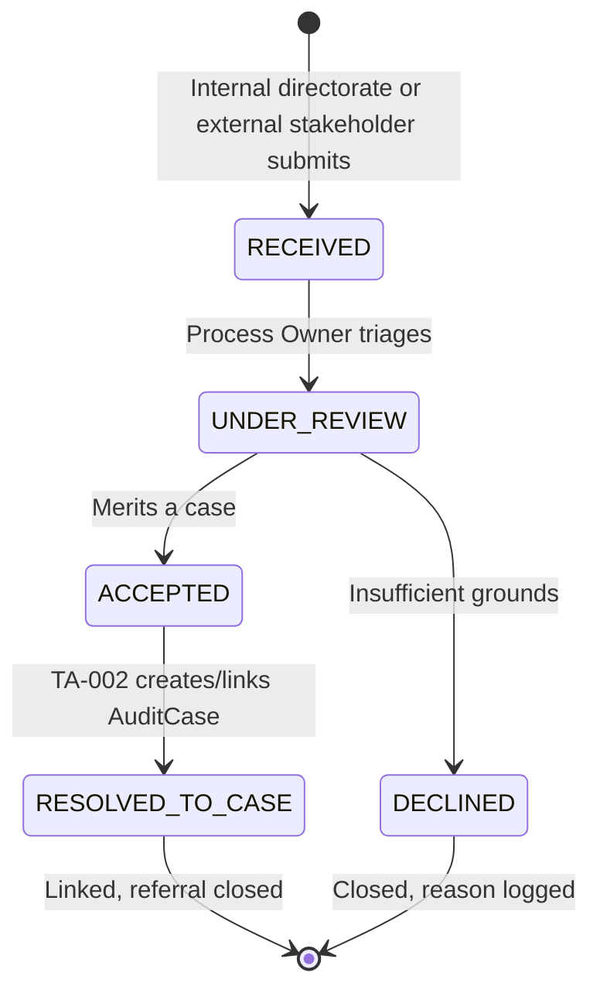

**State Machine: AuditCase (Planning Phase)**

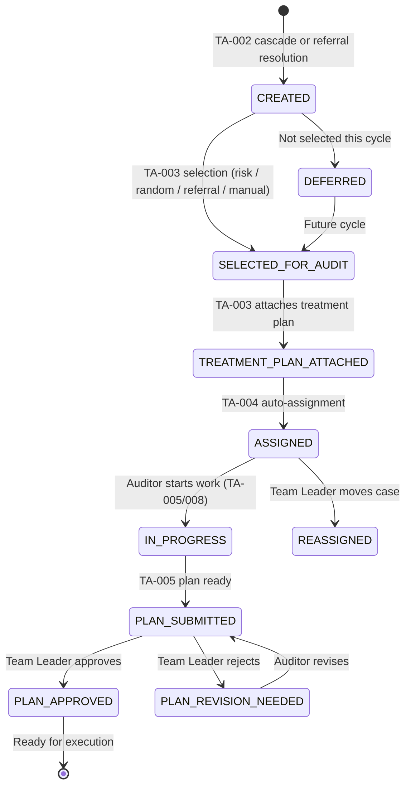

---

### Cluster EX — Audit Execution (2 BUCs)

| BUC | Name | Description | Aggregate | Key Engine Calls |
|:---|:---|:---|:---|:---|
| **TA-009** | Conduct Desk Audit | Remote examination using internal data, 3rd party sources, uploaded docs; draft report; escalate if major issues | `DeskAudit` | integration-engine (banks, customs), tax-type-engine (benchmarks), dms (report storage) |
| **TA-010** | Conduct Comprehensive Audit | In-depth: CAAT-driven testing, financial verification, industry comparison, 3rd party matching, transaction testing; consolidates findings across zones for multi-zone taxpayers | `ComprehensiveAudit` | risk-engine (anomaly detection), rule-engine (CAAT eligibility), ComputerAssistedAuditService (automated testing & recommendations), integration-engine, ledger-engine |

**State Machine: DeskAudit**

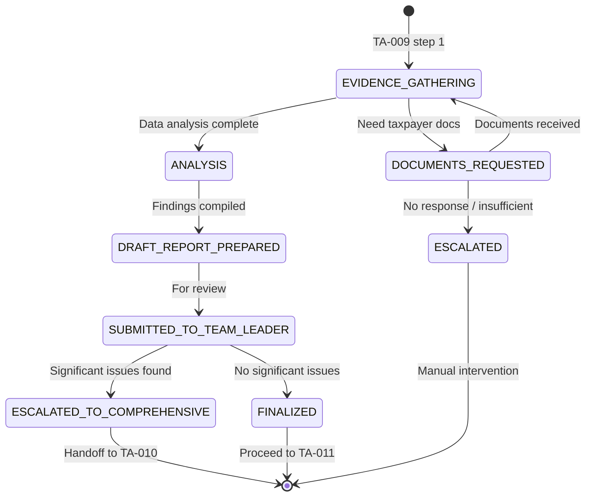

**State Machine: ComprehensiveAudit**

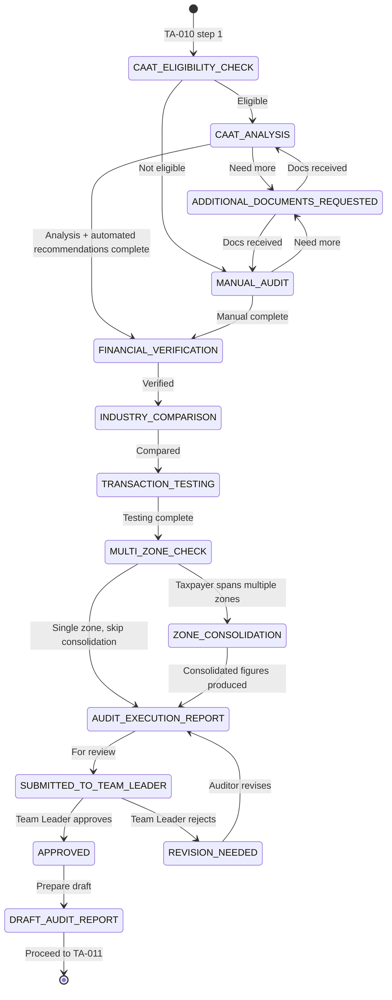

---

### Cluster TP — Transfer Pricing Audit (5 BUCs)

| BUC | Name | Description | Aggregate | Key Engine Calls |
|:---|:---|:---|:---|:---|
| **TA-012** | Initiate Transfer Pricing Audit Case | Identify TP risks; evaluate referrals; Review Committee decides to proceed | `TransferPricingAudit` | risk-engine (TP risk indicators), rule-engine (referral validation) |
| **TA-013** | Plan Transfer Pricing Audit | Materiality, industry research, sampling configuration, audit plan for approval | `TransferPricingAudit`, `AuditSamplingConfiguration` (VO) | tax-type-engine (industry data), rule-engine (TP methods) |
| **TA-014** | Conduct TP Audit Fieldwork | Examine financial records, related-party transactions, verify data, sampling | `TransferPricingAudit` | integration-engine (customs, bank records), ledger-engine |
| **TA-015** | Perform Transfer Pricing Analysis | Analyze transactions using methods (CUP, TNMM, etc.); compare with market data; arm's-length evaluation | `TransferPricingAudit` | rule-engine (method selection logic), integration-engine (comparable data) |
| **TA-016** | Prepare and Review TP Audit Report | Document findings; discuss with taxpayer; internal review and approval | `AuditReport` | dms (report render), workflow-engine (approval) |

**State Machine: TransferPricingAudit**

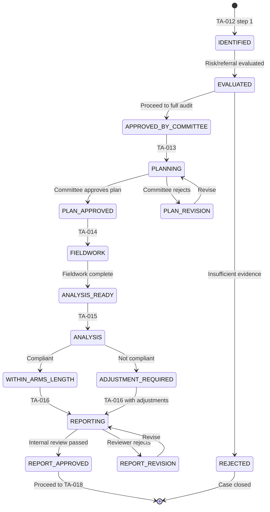

---

### Cluster JA — Joint Audit (3 BUCs)

> **v2 expansion:** the SoR describes Joint Audit as a multi-stage flow — case selection, detailed risk assessment, committee decision, team-leader assignment, planning, execution, and completion. BUC numbering is unchanged (fixed by the BRS), but each BUC's internal steps are now explicit.

| BUC | Name | Description | Aggregate | Key Engine Calls |
|:---|:---|:---|:---|:---|
| **TA-008** | Manage Audit Case Progress (Case Management Module) | Daily work logging against `AuditWorkLog`; Team Leader monitors progress and productivity; warning signs trigger investigation | `AuditCase`, `AuditWorkLog` | workflow-engine (SLA), risk-engine (anomaly detection) |
| **TA-021** | Execute Joint Audit | Cases referred for joint review undergo detailed risk assessment and Committee sign-off; multiple authorities then collaborate via shared workspace with coordinated actions and a unified consolidated report | `JointAudit` | workflow-engine (multi-party approval), dms (shared docs) |
| **TA-022** | Complete and Finalize Audit | Finalize results; exit conference; assessment notice; cross-border consolidation; close case | `AuditReport` | Same as TA-011 + cross-border consolidation |

**State Machine: JointAudit**

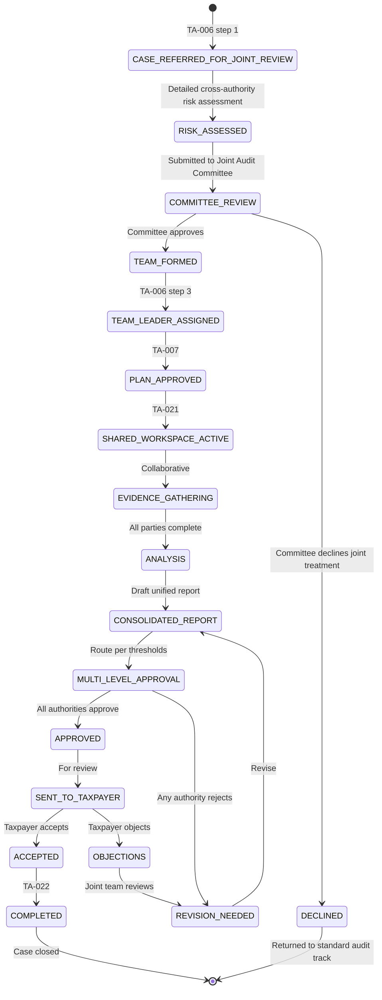

---

### Cluster CM — Communication & Taxpayer Portal (3 BUCs)

| BUC | Name | Description | Aggregate | Key Engine Calls |
|:---|:---|:---|:---|:---|
| **TA-017** | Issue Audit Notices and Manage Communication | Generate notices; track delivery; alternative channels; manage responses. Also handles Issue Audit notices (FR-04.6-01) | `TaxpayerCommunication` | dms (notice templates), notification-engine (delivery), integration-engine (physical mail) |
| **TA-019** | Conduct Entry Conference with Taxpayer | Schedule, conduct, document initial meeting | `TaxpayerCommunication` | notification-engine (scheduling), dms (minutes storage) |
| **TA-020** | Manage Taxpayer Communication Portal | Secure portal for notifications, document upload, auditor communication | `TaxpayerCommunication` | notification-engine (portal notifications), dms (document storage) |

---

### Cluster RF — Reporting & Finalization (2 BUCs)

| BUC | Name | Description | Aggregate | Key Engine Calls |
|:---|:---|:---|:---|:---|
| **TA-011** | Manage Audit Reporting and Finalization | Working papers, draft report, exit conference, multi-level approval, assessment notice with tracking | `AuditReport` | workflow-engine (approval thresholds), dms (report render + sign), notification-engine |
| **TA-018** | Issue Assessment Notice and Conclude Audit | Final assessment; taxpayer objection period; fraud referral; case closure | `AuditReport` | workflow-engine (objection SLA), ledger-engine (assessment posting), notification-engine |

**State Machine: AuditReport**

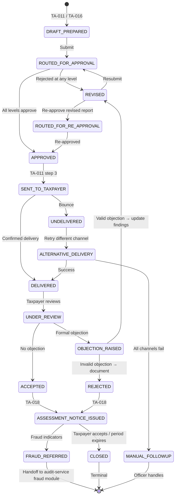

---

### Cluster QA — Quality Assurance & Oversight (2 BUCs)

> **v2 fix:** Orphan `SERIOUS_ISSUES_FOUND` state corrected; recommendation verification tracking added.

| BUC | Name | Description | Aggregate | Key Engine Calls |
|:---|:---|:---|:---|:---|
| **TA-023** | Conduct Quality Assurance Review | Select completed audits; review for standards compliance; issue recommendations; track and verify whether follow-up actions and procedural adjustments were actually implemented; escalate serious issues for disciplinary action | `QualityAssuranceReview` | rule-engine (sampling method), workflow-engine (review assignment) |
| **TA-024** | Trigger Fraud Investigation | Auto/manual escalation when suspicious activity detected | `FraudInvestigation` | risk-engine (fraud indicators), workflow-engine (escalation), audit-service (handoff) |

**State Machine: QualityAssuranceReview**

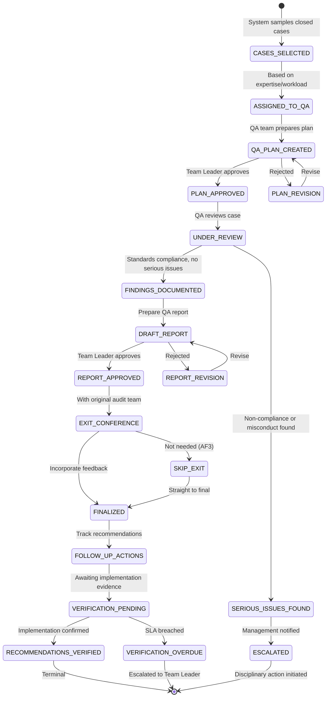

---

### Cluster IA — Issue Audit 

Issue Audit is a **targeted, issue-specific investigation** triggered when noncompliance indicators are identified in a specific transaction set or tax area within an open `AuditCase`. It is narrower than a full Desk Audit (TA-009) and always sits under an existing `AuditCase` — it does not replace the full audit lifecycle, but investigates a focused noncompliance concern within it.

**Key design decisions for this cluster:**

- `IssueAudit` is a new aggregate root linked to its parent `AuditCase` via `auditCaseId`. A case can only have one `IssueAudit` at a time; a case must be in `IN_PROGRESS` or `PLAN_APPROVED` status for an Issue Audit to be initiated.
- `IssueAuditScope` is a value object that captures each selected transaction/noncompliance area; all auditee document uploads must reference a `scopeItemId` from this list (resolves L-03).
- `IssueAuditMode` enum (DESK | FIELD | HYBRID) controls whether field visit steps are permitted (resolves L-01). Mode is set at scope selection (TA-025) and is immutable thereafter.
- A `maxRevisionCount` per approval level (Team Leader and Process Owner) is enforced by the `IssueAuditEscalationService`; once exceeded, the case is automatically escalated to the Director (resolves L-04).
- An SLA timer is attached to the `NOTICE_ISSUED` state via workflow-engine; expiry auto-advances the audit to `SCOPE_SELECTED` (or `EVIDENCE_GATHERING` if scope already defined) with a logged warning (resolves L-02).
- Three director outcomes each emit a distinct domain event (resolves L-05).

| BUC | Name | FR Source | Description | Aggregate | Key Engine Calls |
|:---|:---|:---|:---|:---|:---|
| **TA-025** | Issue Audit Notice to Auditee | FR-04.6-01 | Auditor sends formal notification if required; workflow-engine SLA timer starts on delivery | `IssueAudit` + `TaxpayerCommunication` | dms (notice template), notification-engine (delivery), workflow-engine (SLA timer) |
| **TA-025** | Select Audit Scope | FR-04.6-02 | Auditor selects transactions and noncompliance areas; creates `IssueAuditScope` entries that gate subsequent evidence uploads; sets immutable `auditMode` | `IssueAuditScope` | tax-type-engine (area lookup), rule-engine (eligibility) |
| **TA-025** | Gather Issue Audit Evidence | FR-04.6-03 | Auditor gathers evidence from internal and third-party sources; auditee uploads additional documents (must reference `scopeItemId`) | `IssueAudit` | integration-engine (banks, customs), dms (document storage), notification-engine (upload request to auditee) |
| **TA-025** | Capture Field Visit Findings | FR-04.6-04 | When `auditMode` = FIELD or HYBRID: auditor captures findings from in-person visit; blocked for DESK mode by domain invariant | `IssueAudit` | dms (field notes storage), workflow-engine (visit scheduling) |
| **TA-025** | Draft Issue Audit Report and Submit for Review | FR-04.6-05/06 | Auditor drafts report; submits to Team Leader; if rejected, auditor revises; if approved, forwards to Process Owner; if Process Owner rejects, auditor revises; `maxRevisionCount` enforced per level by `IssueAuditEscalationService` | `AuditReport` | workflow-engine (two-level approval chain), dms (draft storage) |
| **TA-025** | Director Review and Escalation Decision | FR-04.6-07 | Director reviews Process-Owner-approved report; decides: (a) generate audit report — no follow-up required, (b) trigger fraud investigation, (c) trigger comprehensive audit | `AuditReport` | workflow-engine (director routing), audit-service (fraud handoff), notification-engine |

**State Machine: IssueAudit**

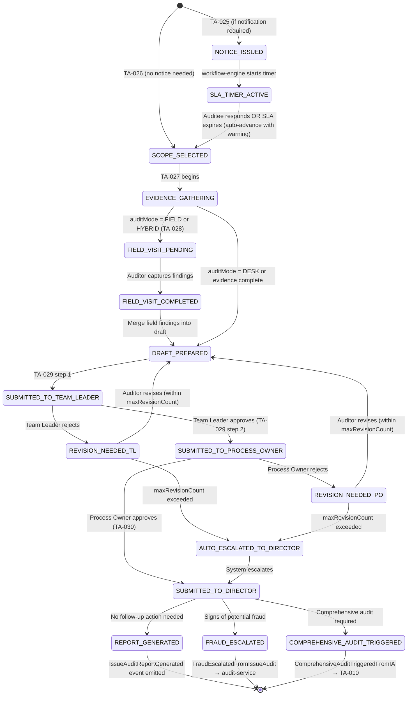

---

## 7. Refined Design Rules (Tax Audit Specific)

### Rule 1 — Audit Case is the Central Aggregate

Every audit activity (planning, execution, reporting, QA, issue audit) revolves around the `AuditCase` aggregate. It holds:
- `caseReferenceNumber` (unique, auto-generated)
- `taxpayerPartyId` (from party-service via registration-service)
- `tin` (denormalized for convenience)
- `assignedAuditorId` / `teamLeaderId`
- `auditType` (DESK, COMPREHENSIVE, TRANSFER_PRICING, JOINT, ISSUE)
- `status` (lifecycle state)
- `source` (see Rule 11) and `sourceReferralId`
- `treatmentPlan` (see Rule 13)
- `annualPlanId` (link back to plan)

### Rule 2 — Risk Engine Integration at Every Gate, With Profiling Depth

The risk-engine is consulted at multiple points, and `RiskProfilingService` (a domain service inside Tax Audit) is responsible for assembling the inputs it needs. Risk profiling spans: filing behaviour analysis, payment behaviour analysis, import/export reconciliation, third-party data matching, anomaly and under-reporting detection, forensic modelling for fraud-adjacent indicators, and risk indicator adjustment based on audit outcomes (feedback loop).

This depth applies at:
- **Planning**: risk-based case selection (TA-003)
- **Assignment**: workload balancing (TA-004)
- **Execution**: anomaly detection during audit (TA-008, TA-010)
- **TP Analysis**: profit-shifting indicators (TA-015)
- **Issue Audit**: noncompliance area risk scoring at scope selection (TA-025) 
- **QA**: sampling method for case selection (TA-023)
- **Fraud**: pattern matching for auto-escalation (TA-024)

### Rule 3 — Immutable Audit Trail

Every action on an audit case creates an immutable `AuditTrailEntry`:
- Who (actor ID from `X-Actor-Id` header)
- What (action type: CREATE, UPDATE, APPROVE, REJECT, etc.)
- When (timestamp with timezone)
- Why (reason text for decisions)
- Before/After state (JSON diff)

Stored in `audit_case_audit_log` table with 7-year retention. Issue Audit actions use the same table with `entityType = ISSUE_AUDIT`. 

### Rule 4 — Document Management via DMS Events

Tax Audit **never** stores PDFs, templates, or signed documents. It emits events:
- `AuditReportRenderRequested` → dms produces PDF
- `AssessmentNoticeRenderRequested` → dms produces notice
- `IssueAuditNoticeRenderRequested` → dms produces Issue Audit notice 
- `IssueAuditReportRenderRequested` → dms produces Issue Audit final report 
- `CertificateRevokeRequested` → dms handles revocation

DMS returns `documentId` which is stored on the aggregate.

### Rule 5 — Taxpayer Communication Portal is Orchestration-Only

The actual secure portal UI is owned by the **portal team** (frontend MFE). Tax Audit service:
- Emits `PortalNotificationRequested` events
- Receives `PortalDocumentUploaded` events from portal
- Validates document links against case **and against `IssueAuditScope.scopeItemId`** (Issue Audit uploads only) ★
- Does NOT implement file storage, encryption, or session management

### Rule 6 — Ledger Integration for Assessments

When an assessment notice is issued (TA-018):
- Tax Audit calls `LedgerEnginePort.postAssessment(tin, taxType, amount, assessmentNoticeId)`
- Ledger-engine creates the subledger entry (PRINCIPAL account)
- If penalties/interest apply, separate calls for PENALTY and INTEREST accounts
- This is the **only** point where Tax Audit writes to ledger; all other ledger interactions are read-only

### Rule 7 — External Data Fallback

When 3rd party data (banks, customs) is unavailable:
- System uses **last cached snapshot** with warning flag
- Auditor is notified and can proceed with manual verification
- The fallback is logged in audit trail
- No automatic retry that blocks the audit — human decision required

### Rule 8 — Workflow Engine for All Multi-Step Approvals

Any approval chain with more than one step OR with SLA timers goes through workflow-engine:
- Annual plan: Director → Business Units → Senior Management
- Audit plan: Auditor → Team Leader (and Committee for Joint/TP)
- Assessment notice: Auditor → Team Leader → Director (threshold-based)
- QA review: QA Team → Team Leader → (Exit Conference optional) → Recommendation verification
- Fraud escalation: Auto-flag → Team Leader confirm → Investigation Team
- **Issue Audit report**: Auditor → Team Leader → Process Owner → Director (TA-025) ★
- **Issue Audit SLA**: workflow-engine SLA timer on `NOTICE_ISSUED` state (TA-025) ★
- **Issue Audit revision cap**: workflow-engine enforces `maxRevisionCount` per level before auto-escalation (TA-025) ★

### Rule 9 — Case Management Service for Disputes

Taxpayer objections, appeals, and dispute resolution are **not** handled in Tax Audit. When a taxpayer objects:
- Tax Audit emits `ObjectionRaised` event with case context
- Case-management-service takes over the dispute workflow
- Tax Audit pauses case closure until `ObjectionResolved` event received
- If objection is valid, Tax Audit receives `AuditFindingsRevisionRequired` and re-enters report revision flow

### Rule 10 — Fraud Investigation Handoff

When fraud is detected (TA-024 or TA-025 director decision):
- Tax Audit creates `FraudInvestigation` aggregate with `status = PENDING_HANDOFF`
- Emits `FraudInvestigationTriggered` or `FraudEscalatedFromIssueAudit` event to audit-service fraud module ★
- Audit-service creates its own case and takes over
- Tax Audit case is **paused** (not closed)
- On `FraudInvestigationCleared` event, Tax Audit resumes to TA-011/018
- On `FraudSubstantiated` event, Tax Audit case is closed with fraud flag

### Rule 11 — Case Sourcing Is Explicit and Traceable

The SoR requires that the risk model receive feedback from random sampling, which is only possible if every case's origin is recorded — not inferred. `AuditCase.source` is one of:
- `RISK_ENGINE` — generated from risk-ranked pool
- `INTERNAL_REFERRAL` — another directorate requested the audit
- `EXTERNAL_REFERRAL` — an external stakeholder requested the audit
- `MANUAL_SELECTION` — management nominated the case directly
- `RANDOM_SAMPLE` — drawn purely at random to validate/calibrate the risk model

### Rule 12 — Sampling Is Configurable, Not Hardcoded

`AuditPlan` (and `TransferPricingAudit` planning) carry an `AuditSamplingConfiguration` value object with:
- `method`: `RANDOM`, `SYSTEMATIC`, `STRATIFIED`, `RISK_BASED`, or `CUSTOM`
- `parameters`: method-specific settings (e.g. stratum boundaries, interval size)
- `sampleSize` and `confidenceLevel`

A `SamplingService` domain service is responsible for producing and validating these configurations.

### Rule 13 — Treatment Plans Travel With the Case

A `TreatmentPlan` (planType, recommended actions, target completion date, complexity rating) is attached to `AuditCase` at selection time (TA-003) as an embedded value object. It is revisited at QA (TA-023) when checking whether recommended actions were actually carried out.

### Rule 14 — Auditor Capacity & Targets Are Delegated

Auditor target-setting is a workforce-management concern. The service consults a `workforce-engine` port at assignment time (TA-004) purely as a capacity/eligibility check — it does not own or mutate target data.

### Rule 15 — CAAT Is a First-Class Domain Service, Not a Footnote

`ComputerAssistedAuditService` is a dedicated domain service responsible for: determining CAAT eligibility (in concert with rule-engine), running automated transaction testing, and generating automated recommendations that seed `ComprehensiveAudit.transactionTests`.

### Rule 16 — Multi-Zone Audits Consolidate, Not Duplicate

A taxpayer operating across multiple zones still gets **one** `AuditCase` and **one** `ComprehensiveAudit`. The aggregate carries `taxpayerZoneIds`, an `isMultiZoneConsolidated` flag, and a `consolidatedTaxCalculation`. Zone-level detail is retained as segregated annexes within the final report, but the case, the assessment, and the audit trail stay singular.

### Rule 17 — Management Reporting Is Event-Sourced, Not Queried Live

Tax Audit never computes cross-case aggregates itself. Every state transition that matters for reporting emits a domain event; `reporting-service` builds `AuditKpiSnapshot`, `AuditYieldReport`, and `AuditStatusReport` from that event stream.

### Rule 18 -- Issue Audit Governance

The auditor selects an immutable `auditMode` (`DESK`, `FIELD`, or
`HYBRID`) during scope definition (TA-026). `DESK` audits cannot record
field visits, while `FIELD` and `HYBRID` audits trigger pre-visit
notifications. During `EVIDENCE_GATHERING`, all auditee uploads must
reference a valid `IssueAuditScope`. Revision counts are tracked per
approval level, and exceeding the configured threshold (default: `3`)
automatically escalates the audit to `SUBMITTED_TO_DIRECTOR`.

## 8. API Surface Summary

### Portal Endpoints (Taxpayer/Auditor-Authenticated)

| Method | Path | BUC | Purpose |
|:---|:---|:---|:---|
| `GET` | `/api/v1/portal/audit-cases` | TA-008 | Auditor views their assigned cases |
| `POST` | `/api/v1/portal/audit-cases/{id}/daily-work` | TA-008 | Log daily work |
| `GET` | `/api/v1/portal/audit-cases/{id}/progress` | TA-008 | View case progress |
| `POST` | `/api/v1/portal/audit-cases/{id}/evidence` | TA-009/010 | Upload evidence |
| `POST` | `/api/v1/portal/audit-cases/{id}/draft-report` | TA-009/010 | Submit draft report |
| `POST` | `/api/v1/portal/audit-cases/{id}/queries` | TA-010 | Issue formal queries to taxpayer |
| `GET` | `/api/v1/portal/taxpayer/audit-notifications` | TA-017 | Taxpayer views audit notices |
| `POST` | `/api/v1/portal/taxpayer/audit-responses` | TA-017 | Taxpayer responds to notices |
| `POST` | `/api/v1/portal/taxpayer/documents` | TA-020 | Taxpayer uploads documents |
| `POST` | `/api/v1/portal/entry-conferences` | TA-019 | Schedule entry conference |
| `POST` | `/api/v1/portal/entry-conferences/{id}/confirm` | TA-019 | Confirm attendance |
| `POST` | `/api/v1/portal/exit-conferences` | TA-011/022 | Schedule exit conference |
| `GET` | `/api/v1/portal/taxpayer/issue-audit/{id}/notice` | TA-025 ★ | Taxpayer views issue audit notice |
| `POST` | `/api/v1/portal/taxpayer/issue-audit/{id}/notice-response` | TA-025 ★ | Taxpayer acknowledges notice |
| `POST` | `/api/v1/portal/taxpayer/issue-audit/{id}/documents` | TA-025 ★ | Taxpayer uploads scoped documents (scopeItemId required) |
| `GET` | `/api/v1/portal/taxpayer/issue-audit/{id}/scope` | TA-025 ★ | Taxpayer views selected audit scope areas |

### Back-Office Endpoints (Officer/Team Leader/Director/Process Owner)

| Method | Path | BUC | Purpose |
|:---|:---|:---|:---|
| `POST` | `/api/v1/backoffice/annual-audit-plans` | TA-001 | Create annual plan |
| `GET` | `/api/v1/backoffice/annual-audit-plans/{id}` | TA-001 | View plan |
| `POST` | `/api/v1/backoffice/annual-audit-plans/{id}/submit` | TA-001 | Submit for approval |
| `POST` | `/api/v1/backoffice/annual-audit-plans/{id}/approve` | TA-001 | Director/Senior Mgmt approve |
| `POST` | `/api/v1/backoffice/annual-audit-plans/{id}/cascade` | TA-002 | Generate cases from plan |
| `POST` | `/api/v1/backoffice/audit-referrals` | TA-002 | Submit internal/external audit referral |
| `POST` | `/api/v1/backoffice/audit-referrals/{id}/triage` | TA-002 | Accept or decline a referral |
| `GET` | `/api/v1/backoffice/audit-cases/pool` | TA-003 | View blended risk/random/referral/manual case pool |
| `POST` | `/api/v1/backoffice/audit-cases/random-draw` | TA-003 | Trigger a random/stratified sample draw |
| `POST` | `/api/v1/backoffice/audit-cases/select` | TA-003 | Select cases for audit |
| `POST` | `/api/v1/backoffice/audit-cases/{id}/treatment-plan` | TA-003 | Attach treatment plan to case |
| `POST` | `/api/v1/backoffice/audit-cases/assign` | TA-004 | Auto-assign cases |
| `POST` | `/api/v1/backoffice/audit-cases/{id}/reassign` | TA-004 | Manual reassignment |
| `GET` | `/api/v1/backoffice/audit-cases/{id}/plan` | TA-005 | View audit plan |
| `POST` | `/api/v1/backoffice/audit-cases/{id}/plan` | TA-005 | Submit audit plan |
| `POST` | `/api/v1/backoffice/audit-cases/{id}/plan/approve` | TA-005 | Team Leader approve plan |
| `POST` | `/api/v1/backoffice/audit-cases/{id}/desk-audit/start` | TA-009 | Start desk audit |
| `POST` | `/api/v1/backoffice/audit-cases/{id}/comprehensive-audit/start` | TA-010 | Start comprehensive audit |
| `POST` | `/api/v1/backoffice/audit-cases/{id}/caat/run` | TA-010 | Trigger CAAT analysis & automated recommendations |
| `POST` | `/api/v1/backoffice/comprehensive-audits/{id}/multi-zone-consolidate` | TA-010 | Consolidate findings across taxpayer zones |
| `POST` | `/api/v1/backoffice/audit-cases/{id}/escalate` | TA-009 | Escalate to comprehensive |
| `POST` | `/api/v1/backoffice/audit-cases/{id}/report` | TA-011 | Submit final report |
| `POST` | `/api/v1/backoffice/audit-cases/{id}/report/approve` | TA-011 | Approve report |
| `POST` | `/api/v1/backoffice/audit-cases/{id}/assessment-notice` | TA-018 | Issue assessment notice |
| `POST` | `/api/v1/backoffice/audit-cases/{id}/conclude` | TA-018 | Close audit case |
| `POST` | `/api/v1/backoffice/joint-audit-teams` | TA-006 | Form joint audit team |
| `POST` | `/api/v1/backoffice/joint-audit-teams/{id}/plan` | TA-007 | Submit joint audit plan |
| `POST` | `/api/v1/backoffice/joint-audit-teams/{id}/workspace-actions` | TA-021 | Log a collaborative action in the shared workspace |
| `POST` | `/api/v1/backoffice/joint-audit-teams/{id}/consolidated-report` | TA-021 | Submit consolidated report draft |
| `POST` | `/api/v1/backoffice/joint-audit-teams/{id}/finalize` | TA-022 | Finalize joint audit and trigger closure |
| `POST` | `/api/v1/backoffice/transfer-pricing-audits` | TA-012 | Initiate TP audit |
| `POST` | `/api/v1/backoffice/transfer-pricing-audits/{id}/plan` | TA-013 | Submit TP plan |
| `POST` | `/api/v1/backoffice/transfer-pricing-audits/{id}/fieldwork` | TA-014 | Complete fieldwork |
| `POST` | `/api/v1/backoffice/transfer-pricing-audits/{id}/analysis` | TA-015 | Submit TP analysis |
| `POST` | `/api/v1/backoffice/transfer-pricing-audits/{id}/report` | TA-016 | Submit TP report |
| `POST` | `/api/v1/backoffice/audit-notices` | TA-017 | Generate audit notice |
| `POST` | `/api/v1/backoffice/audit-notices/{id}/delivery-status` | TA-017 | Update delivery status |
| `POST` | `/api/v1/backoffice/qa-reviews` | TA-023 | Start QA review |
| `POST` | `/api/v1/backoffice/qa-reviews/{id}/complete` | TA-023 | Complete QA review |
| `POST` | `/api/v1/backoffice/qa-reviews/{id}/recommendations/{recId}/verify` | TA-023 | Verify a recommendation was implemented |
| `POST` | `/api/v1/backoffice/fraud-investigations` | TA-024 | Trigger fraud investigation |
| `POST` | `/api/v1/backoffice/fraud-investigations/{id}/handoff` | TA-024 | Handoff to audit-service |
| `POST` | `/api/v1/backoffice/audit-cases/{id}/issue-audit` | TA-025 ★ | Initiate Issue Audit on case |
| `POST` | `/api/v1/backoffice/audit-cases/{id}/issue-audit/notice` | TA-025 ★ | Issue notice to auditee |
| `POST` | `/api/v1/backoffice/audit-cases/{id}/issue-audit/scope` | TA-025 ★ | Select audit scope items (sets immutable auditMode) |
| `GET` | `/api/v1/backoffice/audit-cases/{id}/issue-audit/scope` | TA-025 ★ | View selected scope |
| `POST` | `/api/v1/backoffice/audit-cases/{id}/issue-audit/evidence` | TA-025 ★ | Add internal/3rd-party evidence |
| `POST` | `/api/v1/backoffice/audit-cases/{id}/issue-audit/field-visit` | TA-025 ★ | Capture field visit findings |
| `GET` | `/api/v1/backoffice/audit-cases/{id}/issue-audit` | TA-025 ★ | View Issue Audit state |
| `POST` | `/api/v1/backoffice/audit-cases/{id}/issue-audit/draft-report` | TA-025 ★ | Submit draft report |
| `POST` | `/api/v1/backoffice/audit-cases/{id}/issue-audit/team-leader-review` | TA-025 ★ | Team Leader approve/reject |
| `POST` | `/api/v1/backoffice/audit-cases/{id}/issue-audit/process-owner-review` | TA-025 ★ | Process Owner approve/reject |
| `POST` | `/api/v1/backoffice/audit-cases/{id}/issue-audit/director-decision` | TA-025 ★ | Director outcome (REPORT / FRAUD / COMPREHENSIVE) |

### Webhook Endpoints (System-to-System)

| Method | Path | Source | Purpose |
|:---|:---|:---|:---|
| `POST` | `/api/v1/webhooks/risk-engine/score-updated` | risk-engine | Risk score changed for taxpayer |
| `POST` | `/api/v1/webhooks/registration-service/taxpayer-registered` | registration-service | New taxpayer available for audit |
| `POST` | `/api/v1/webhooks/case-management/objection-resolved` | case-management-service | Objection resolved, resume audit |
| `POST` | `/api/v1/webhooks/audit-service/fraud-cleared` | audit-service | Fraud investigation cleared |
| `POST` | `/api/v1/webhooks/audit-service/fraud-substantiated` | audit-service | Fraud substantiated |
| `POST` | `/api/v1/webhooks/workforce-engine/target-updated` | workforce-engine | Auditor target or capacity changed |
| `POST` | `/api/v1/webhooks/workflow-engine/issue-audit-sla-expired` | workflow-engine | Issue Audit notice SLA expired ★ |

### Internal Endpoints (Service-to-Service)

| Method | Path | Caller | Purpose |
|:---|:---|:---|:---|
| `GET` | `/api/v1/internal/audit-cases/{tin}/active` | filing-service, payment-service | Check if taxpayer under audit |
| `GET` | `/api/v1/internal/audit-cases/{tin}/history` | reporting-service | Audit history for KPIs |
| `GET` | `/api/v1/internal/auditor-targets/{auditorId}` | bs-taxaudit-core-server | Capacity/target check against workforce-engine |
| `GET` | `/api/v1/internal/health` | platform | Liveness probe |
| `GET` | `/api/v1/internal/metrics` | observability | Prometheus metrics |

---

## 9. Domain Events Catalog

### 9.1 Event Flow — Who Consumes What

Before the full catalog, here's the shape of it: most events fan out to just one or two consumers, and the pattern splits cleanly by cluster. Planning events feed reporting and notification; case-lifecycle events feed workflow-engine for timers and routing; the new Issue Audit events largely echo the same workflow-engine dependency but add two hard routing points — one to audit-service when fraud is suspected, one back into TA-010 when a comprehensive audit is warranted. Reporting and fraud events are the ones with real downstream weight, since they're what ledger-engine, case-management-service, and audit-service actually act on.


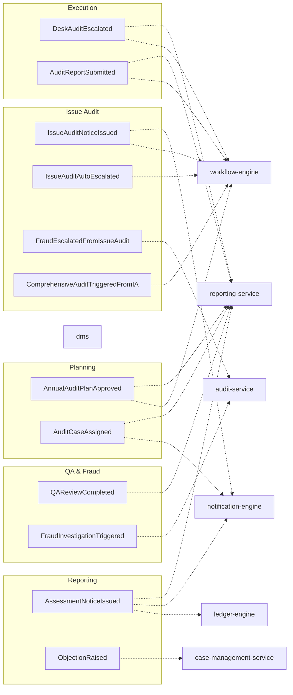

This is a scanning aid, not the source of truth — payload shape, exact emitting BUC, and the full consumer list for every event still live in the table below.

### Events Emitted by Tax Audit

| Event | Emitted By | Consumed By | Key Payload |
|:---|:---|:---|:---|
| `AnnualAuditPlanCreated` | TA-001 | reporting-service | `planId, year, caseCount` |
| `AnnualAuditPlanApproved` | TA-001 | notification-engine | `planId, approvedBy` |
| `AuditCaseCreated` | TA-002 | risk-engine, notification-engine | `caseId, tin, riskScore` |
| `AuditReferralReceived` | TA-002 | risk-engine, notification-engine | `referralId, sourceType, referringEntity, tin` |
| `AuditCaseSelected` | TA-003 | notification-engine, reporting-service | `caseId, selectionBasis` |
| `RandomAuditCaseSelected` | TA-003 | reporting-service, risk-engine | `caseId, samplingMethod` |
| `TreatmentPlanAttached` | TA-003 | notification-engine | `caseId, planType` |
| `AuditCaseAssigned` | TA-004 | notification-engine | `caseId, auditorId, teamLeaderId` |
| `AuditCaseReassigned` | TA-004 | notification-engine | `caseId, oldAuditorId, newAuditorId` |
| `AuditPlanSubmitted` | TA-005 | workflow-engine | `caseId, planId, teamLeaderId` |
| `AuditPlanApproved` | TA-005 | notification-engine | `caseId, planId` |
| `JointAuditPlanApproved` | TA-007 | notification-engine, workflow-engine | `caseId, planId` |
| `AuditWorkLogged` | TA-008 | workflow-engine, reporting-service | `caseId, auditorId, hoursLogged` |
| `AuditProgressUpdated` | TA-008 | reporting-service | `caseId, percentComplete` |
| `DeskAuditStarted` | TA-009 | observability | `caseId, auditorId` |
| `DeskAuditEscalated` | TA-009 | workflow-engine | `caseId, reason` |
| `ComprehensiveAuditStarted` | TA-010 | observability | `caseId, caatEligible` |
| `CAATAnalysisCompleted` | TA-010 | reporting-service | `caseId, automatedFindingsCount` |
| `MultiZoneAuditConsolidated` | TA-010 | reporting-service | `caseId, zoneIds[]` |
| `AuditReportSubmitted` | TA-011 | workflow-engine | `caseId, reportId` |
| `AuditReportApproved` | TA-011 | dms, notification-engine | `caseId, reportId` |
| `AssessmentNoticeIssued` | TA-018 | ledger-engine, notification-engine | `caseId, noticeId, amount` |
| `AuditCaseClosed` | TA-018, TA-022 | reporting-service, notification-engine | `caseId, closureType` |
| `ObjectionRaised` | TA-011 | case-management-service | `caseId, objectionId, taxpayerId` |
| `ObjectionResolved` | (consumed) | workflow-engine | Resume case closure |
| `FraudInvestigationTriggered` | TA-024 | audit-service | `caseId, fraudCaseId, indicators` |
| `FraudInvestigationCleared` | (consumed) | workflow-engine | Resume audit |
| `FraudSubstantiated` | (consumed) | workflow-engine | Close with fraud flag |
| `TPAuditInitiated` | TA-012 | notification-engine | `caseId, tpRiskIndicators` |
| `TPAuditPlanApproved` | TA-013 | notification-engine | `caseId` |
| `TPFieldworkCompleted` | TA-014 | risk-engine, workflow-engine | `caseId` |
| `TPAnalysisCompleted` | TA-015 | workflow-engine | `caseId, armsLengthOutcome` |
| `TPAuditReportApproved` | TA-016 | dms, notification-engine | `caseId, reportId` |
| `JointAuditTeamFormed` | TA-006 | notification-engine | `caseId, teamMembers[]` |
| `JointAuditEvidenceSubmitted` | TA-021 | notification-engine | `caseId, contributingAuthorityId` |
| `JointAuditCompleted` | TA-022 | reporting-service | `caseId, participatingAuthorities[]` |
| `QAReviewCompleted` | TA-023 | reporting-service | `caseId, findings, followUps[]` |
| `QARecommendationVerified` | TA-023 | reporting-service | `caseId, recommendationId, implemented` |
| `PortalDocumentUploaded` | (consumed, from portal) | Tax Audit | `caseId, documentId` |
| `EntryConferenceScheduled` | TA-019 | notification-engine | `caseId, date, venue` |
| `EntryConferenceCompleted` | TA-019 | dms | `caseId, minutesDocumentId` |
| `ExitConferenceScheduled` | TA-011 | notification-engine | `caseId, date` |
| `ExitConferenceCompleted` | TA-011 | dms | `caseId, minutesDocumentId` |
| `AuditNoticeDelivered` | TA-017 | workflow-engine | `caseId, noticeId, channel` |
| `AuditNoticeUndelivered` | TA-017 | workflow-engine | `caseId, noticeId, retryCount` |
| `AuditTargetAssigned` | (consumed, from workforce-engine) | Tax Audit | `auditorId, period, targetCaseCount` |
| `IssueAuditNoticeIssued` | TA-025 ★ | notification-engine, workflow-engine (SLA) | `caseId, issueAuditId, noticeDocumentId, responseDeadline` |
| `IssueAuditScopeSelected` | TA-025 ★ | observability | `caseId, issueAuditId, scopeItems[], auditMode` |
| `IssueAuditEvidenceGathered` | TA-025 ★ | observability | `caseId, issueAuditId, evidenceCount` |
| `IssueAuditFieldVisitCaptured` | TA-025 ★ | dms | `caseId, issueAuditId, fieldNotesDocumentId` |
| `IssueAuditDraftSubmitted` | TA-029 ★ | workflow-engine | `caseId, issueAuditId, submittedTo` |
| `IssueAuditApprovedByTeamLeader` | TA-025 ★ | workflow-engine | `caseId, issueAuditId, teamLeaderId` |
| `IssueAuditApprovedByProcessOwner` | TA-025 ★ | workflow-engine | `caseId, issueAuditId, processOwnerId` |
| `IssueAuditAutoEscalated` | TA-025 ★ | workflow-engine, notification-engine | `caseId, issueAuditId, level, revisionCount` |
| `IssueAuditReportGenerated` | TA-025 ★ | dms, reporting-service, notification-engine | `caseId, issueAuditId, reportDocumentId` |
| `FraudEscalatedFromIssueAudit` | TA-025 ★ | audit-service | `caseId, issueAuditId, indicators, directorId` |
| `ComprehensiveAuditTriggeredFromIA` | TA-025 ★ | workflow-engine | `caseId, issueAuditId, reason` |

---

## 10. Data Sanity Check Rules

### Level 1 — Field-Level

| Field | Validation |
|:---|:---|
| `caseReferenceNumber` | Unique, format: `AUD-YYYY-NNNNNN`, auto-generated |
| `tin` | Valid TIN format, must exist in registration-service |
| `taxpayerPartyId` | Valid UUID, cross-check with party-service |
| `auditType` | Enum: DESK, COMPREHENSIVE, TRANSFER_PRICING, JOINT |
| `riskLevel` | Enum: LOW, MEDIUM, HIGH, CRITICAL |
| `samplingMethod` | Enum from tax-type-engine rule package |
| `assessmentAmount` | Non-negative, ≤ 18 digits, 2 decimal places |
| `penaltyAmount` | Non-negative, calculated by rule-engine |
| `interestAmount` | Non-negative, calculated by rule-engine |
| `dates` | `tentativeStartDate` ≤ `tentativeEndDate`; not in past for new plans |
| `status transitions` | Valid per state machine; illegal transitions rejected |


### Level 2 — Cross-Field

| Check | Applied |
|:---|:---|
| Case can only have ONE active audit type at a time | All execution BUCs |
| Auditor assignment must match case complexity to auditor experience | TA-004 |
| Team Leader cannot be same as assigned Auditor | TA-004 |
| Assessment notice can only be issued after report approval | TA-018 |
| Objection period must be within legally configured days | TA-018 |
| QA review cannot be for a case still open | TA-023 |
| Fraud investigation cannot trigger on already-closed case | TA-024 |

---
### Level 3 — Engine-Mediated

- Risk score calculation → risk-engine
- CAAT eligibility → rule-engine
- TP method selection → rule-engine
- Assessment calculation → ledger-engine (principal + penalty + interest)
- Industry benchmark comparison → tax-type-engine

---

## 11. Git Repository Structure

Per the ITAS Manifesto naming conventions:

```
ITAS/
├── business-solutions/
│   └── taxaudit/
│       ├── bs-taxaudit-core-server        ← This service
│       ├── bs-taxaudit-ui                 ← Angular MFE for back-office
│       └── bs-taxaudit-portal-ui          ← Angular MFE for taxpayer portal
│
├── engines/
│   └── risk/
│       ├── eng-risk-scorer                ← Risk scoring & profiling (consumed by tax audit)
│       └── eng-risk-ui
│   └── rule/
│       ├── eng-rule-evaluator             ← Audit procedure rules, CAAT eligibility, IA revision cap
│       └── eng-rule-ui
│   └── workflow/
│       ├── eng-workflow-orchestrator      ← Approval workflows, IA SLA timers
│       └── eng-workflow-ui
│   └── ledger/
│       ├── eng-ledger-journal             ← Assessment posting
│       └── eng-ledger-ui
│   └── integration/
│       ├── eng-integration-gateway        ← Banks, customs, MoTRI
│       └── eng-integration-ui
│   └── workforce/
│       ├── eng-workforce-capacity         ← Auditor targets, workload, capacity
│       └── eng-workforce-ui
│
├── adapters/
│   └── risk/
│       └── adp-risk-taxaudit              ← Risk adapter for tax audit domain
│   └── rule/
│       └── adp-rule-taxaudit              ← Rule adapter for tax audit domain
│   └── workflow/
│       └── adp-workflow-taxaudit          ← Workflow adapter for tax audit
│   └── ledger/
│       └── adp-ledger-taxaudit            ← Ledger adapter for tax audit
│   └── integration/
│       └── adp-integration-taxaudit       ← Integration adapter for tax audit
│   └── workforce/
│       └── adp-workforce-taxaudit         ← Workforce adapter for tax audit
│
├── integrators/
│   └── government/
│       ├── int-government-tax-authority   ← Tax authority APIs
│       └── int-government-customs         ← Customs data
│   └── banking/
│       ├── int-banking-statement          ← Bank statement ingestion
│       └── int-banking-swift              ← SWIFT transactions
│
├── server/libraries/
│   ├── lib-server-auth
│   ├── lib-server-logging
│   ├── lib-server-observability
│   └── lib-server-messaging
│
└── infra/
    └── gitops/
        └── itas-deployment-manifests      ← Umbrella for UAT/Prod
```

> Note: `ComputerAssistedAuditService`, `RiskProfilingService`, `SamplingService`, and `IssueAuditEscalationService` are **internal domain services** — they live inside `bs-taxaudit-core-server` and are not reused elsewhere yet. Only the workforce concern warranted a new engine + adapter pair, since target-setting is genuinely an HR/workforce-management capability rather than an audit one.

---

## 12. Cross-Reference to Original BRS + FR-04.6

| Source | BUC | Cluster | Notes |
|:---|:---|:---|:---|
| BRS §1.02 | TA-001 | AP | Annual plan creation |
| BRS §1.03 | TA-002 | AP | Case cascade + referral intake |
| BRS §1.04 | TA-003 | AP | Case selection — risk / random / referral / manual + treatment plan |
| BRS §1.05 | TA-004 | AP | Auditor assignment, checked against workforce targets |
| BRS §1.06 | TA-005 | AP | Individual audit plan + sampling configuration |
| BRS §1.07 | TA-006 | AP | Joint audit team formation (with risk assessment + committee decision) |
| BRS §1.08 | TA-007 | AP | Joint audit plan |
| BRS §1.09 | TA-008 | JA | Case progress — Case Management Module (work logs, productivity) |
| BRS §1.10 | TA-009 | EX | Desk audit |
| BRS §1.11 | TA-010 | EX | Comprehensive audit — CAAT + multi-zone consolidation |
| BRS §1.12 | TA-011 | RF | Reporting & finalization |
| BRS §1.13 | TA-012 | TP | TP audit initiation |
| BRS §1.14 | TA-013 | TP | TP audit planning |
| BRS §1.15 | TA-014 | TP | TP fieldwork |
| BRS §1.16 | TA-015 | TP | TP analysis |
| BRS §1.17 | TA-016 | TP | TP report |
| BRS §1.18 | TA-017 | CM | Audit notices (also handles FR-04.6-01 notice channel) |
| BRS §1.19 | TA-018 | RF | Assessment & conclusion |
| BRS §1.20 | TA-019 | CM | Entry conference |
| BRS §1.21 | TA-020 | CM | Taxpayer portal |
| BRS §1.22 | TA-021 | JA | Execute joint audit (granular sub-states) |
| BRS §1.23 | TA-022 | JA | Complete & finalize |
| BRS §1.24 | TA-023 | QA | Quality assurance (recommendation verification added) |
| BRS §1.25 | TA-024 | QA | Fraud investigation |
| FR-04.6-01 | TA-025 | IA ★ | Issue audit notice + SLA timer |
| FR-04.6-02 | TA-025 | IA ★ | Select audit scope + set immutable auditMode |
| FR-04.6-03 | TA-025 | IA ★ | Gather issue evidence (scope-gated uploads) |
| FR-04.6-04 | TA-025 | IA ★ | Field visit findings (mode-gated) |
| FR-04.6-05/06 | TA-025 | IA ★ | Draft report + two-level review with revision cap |
| FR-04.6-07 | TA-025 | IA ★ | Director review + three distinct escalation outcomes |

---

## 13. Key Design Decisions

| Decision | Rationale |
|:---|:---|
| **Single `bs-taxaudit-core-server`** vs splitting into planning/execution/reporting services | Audit lifecycle is tightly coupled; splitting would create excessive cross-service chatter and consistency issues |
| **AuditCase as central aggregate** | All BUCs operate on a case; natural cohesion point |
| **DMS event-based document handling** | Tax Audit doesn't need to own document rendering, signing, or storage |
| **Ledger write only at assessment** | Audit is about investigation; ledger is about financial recording; separation of concerns |
| **Case-management-service for disputes** | Disputes have their own SLA, appeal chains, and legal workflows; don't duplicate |
| **Audit-service fraud module for investigations** | Fraud investigation is a specialized domain with different procedures, legal requirements, and teams |
| **Risk-engine at every gate** | Risk-based approach is core to modern tax audit; not just planning but ongoing monitoring |
| **TreatmentPlan as an embedded value object, not an aggregate** | It has no identity or lifecycle independent of the case it's attached to |
| **AuditorTarget delegated to a new `workforce-engine`** | Target-setting is an HR/workforce capability; keeping it out of the audit domain avoids scope creep and a second source of truth for capacity |
| **Management reporting fully event-sourced into reporting-service** | Avoids turning Tax Audit into a live-query reporting bottleneck; centralizes KPI computation in one place |
| **CAAT as an internal domain service, not a new microservice** | Tightly coupled to `ComprehensiveAudit`/TP execution today; no second consumer yet to justify extraction |
| **Explicit `AuditCaseSource` enum + `AuditReferral` aggregate** | The risk model's feedback loop depends on knowing which cases were randomly sampled vs risk-selected vs referred |
| **IssueAudit as sub-type under AuditCase rather than independent case** ★ | Issue Audit is always triggered within an ongoing audit; sharing the AuditCase parent avoids data duplication and maintains the single case reference for reporting |
| **IssueAuditMode immutable after scope selection** ★ | Once the auditor has declared the audit mode, evidence collection and field visit decisions have already been made; allowing mid-audit mode changes would invalidate gathered evidence |
| **maxRevisionCount via rule-engine** ★ | The acceptable number of revisions is a legal/policy configuration, not a code constant; rule-engine ownership allows it to be changed per tax authority without a deployment |
| **Three distinct director outcome events** ★ | Each outcome routes to different consumers (dms vs audit-service vs workflow-engine); a single generic event with an outcome field would require conditional consumer logic — violates open/closed principle |
| **IssueAuditEscalationService as internal domain service** ★ | Revision cap and auto-escalation logic is purely a domain concern with no external consumer; does not warrant its own microservice |

---

## 14. Hexagonal Architecture Principles Applied

### Dependency Direction (Inward)

```
┌─────────────────────────────────────────┐
│  API Layer (Inbound Adapter)            │
│  → Controllers, DTOs, Validation        │
├─────────────────────────────────────────┤
│  Application Layer (Orchestration)      │
│  → Use Cases, App Services, Ports       │
├─────────────────────────────────────────┤
│  Domain Layer (Core Business)           │
│  → Aggregates, Domain Services, Events  │
├─────────────────────────────────────────┤
│  Persistence Layer (Database Adapter)   │
│  → JPA Entities, Repository Adapters    │
├─────────────────────────────────────────┤
│  Infrastructure Layer (External)        │
│  → Kafka, HTTP Clients, Config          │
└─────────────────────────────────────────┘
```

**Key Principles:**
- **Dependency Rule**: Dependencies point inward only. Domain layer has zero dependencies on frameworks.
- **Ports & Adapters**: Inbound ports (use cases) are implemented by the API layer. Outbound ports (interfaces) are implemented by persistence and infrastructure layers.
- **Separation of Concerns**: Each layer has a single responsibility.
- **Testability**: Domain logic can be unit tested without Spring context, database, or HTTP clients.
- **Flexibility**: Swap JPA for MongoDB, or Kafka for RabbitMQ, without touching domain code.

### Layer Responsibilities

| Layer | Responsibility | Examples in Tax Audit |
|:---|:---|:---|
| **API Layer** | Handle HTTP requests, validate inputs, call application use cases, return appropriate HTTP responses | `PortalAuditCaseController`, `BackOfficeAnnualPlanController`, `BackOfficeIssueAuditController`, `AuditCaseRequestDto`, `IssueAuditRequestDto`, `GlobalExceptionHandler` |
| **Application Layer** | Orchestrate use cases, manage transactions, coordinate domain logic, use outbound ports | `CreateAnnualPlanUseCase`, `AuditPlanningService`, `IssueAuditService`, `AssignCaseCommand`, `IssueAuditNoticeCommand`, `DirectorReviewCommand`, `SelectIssueAuditScopeUseCase`, `GatherIssueEvidenceUseCase`, `CaptureFieldVisitUseCase`, `DraftIssueAuditReportUseCase`, `DirectorReviewIssueAuditUseCase` |
| **Domain Layer** | Pure business logic, framework independent, no database/external dependencies, enforce business rules and invariants | `AuditCase` (Aggregate Root), `IssueAudit` (Aggregate Root), `IssueAuditScope` (Value Object), `TreatmentPlan` (Value Object), `AuditSamplingConfiguration` (Value Object), `RiskProfilingService`, `ComputerAssistedAuditService`, `SamplingService`, `IssueAuditEscalationService`, all domain events |
| **Persistence Layer** | Implement repository ports, database operations, JPA mapping, data persistence | `JpaAuditCaseRepositoryAdapter`, `JpaIssueAuditRepositoryAdapter`, `JpaIssueAuditScopeRepositoryAdapter`, `IssueAuditJpaEntity`, `IssueAuditScopeJpaEntity`, `IssueAuditMapper` |
| **Infrastructure Layer** | Publish events, integrate external systems, infrastructure concerns | `KafkaEventPublisherAdapter`, `OutboxPoller`, `RiskEngineClient`, `LedgerEngineClient`, `WorkflowEngineClient`, `NotificationEngineClient`, `WorkforceEngineClient` |

### Outbox Pattern

Domain events are persisted to an `outbox` table atomically with the aggregate save, then polled by `OutboxPoller` for Kafka delivery. This ensures "save + publish" atomicity without distributed transactions.

##  Quick Reference

**Which BUC interacts with which engine/service?**

| BUC | Risk | Workforce | Tax Type | Integration | Rule | Workflow | Notification | DMS | Ledger | Reporting | Case Mgmt | Audit |
|-----|:---:|:---------:|:--------:|:-----------:|:----:|:--------:|:------------:|:---:|:------:|:---------:|:---------:|:-----:|
| TA-001 | ✓ | ✓ | – | – | – | ✓ | ✓ | – | – | ✓ | – | – |
| TA-002 | ✓ | – | – | – | – | – | – | – | – | ✓ | – | – |
| TA-003 | ✓ | – | – | – | ✓ | ✓ | – | – | – | ✓ | – | – |
| TA-004 | – | ✓ | – | – | ✓ | – | ✓ | – | – | ✓ | – | – |
| TA-005 | – | – | ✓ | ✓ | ✓ | ✓ | – | – | – | ✓ | – | – |
| TA-006 | ✓ | – | – | – | – | ✓ | ✓ | – | – | ✓ | – | – |
| TA-007 | – | – | ✓ | – | ✓ | ✓ | – | – | – | ✓ | – | – |
| TA-008 | ✓ | – | – | – | – | ✓ | – | – | – | ✓ | – | – |
| TA-009 | ✓ | – | ✓ | ✓ | – | ✓ | – | ✓ | – | ✓ | – | – |
| TA-010 | ✓ | – | ✓ | ✓ | ✓ | ✓ | – | ✓ | ✓ | ✓ | – | – |
| TA-011 | – | – | – | – | – | ✓ | ✓ | ✓ | – | ✓ | – | – |
| TA-012 | ✓ | – | – | – | ✓ | ✓ | – | – | – | ✓ | – | – |
| TA-013 | – | – | ✓ | – | ✓ | ✓ | – | – | – | ✓ | – | – |
| TA-014 | – | – | – | ✓ | – | ✓ | – | ✓ | ✓ | ✓ | – | – |
| TA-015 | ✓ | – | ✓ | ✓ | ✓ | – | – | – | – | ✓ | – | – |
| TA-016 | – | – | – | – | – | ✓ | – | ✓ | – | ✓ | – | – |
| TA-017 | – | – | – | – | – | ✓ | ✓ | ✓ | – | ✓ | – | – |
| TA-018 | – | – | – | – | – | ✓ | ✓ | ✓ | ✓ | ✓ | ✓ | ✓* |
| TA-019 | – | – | – | – | – | – | ✓ | ✓ | – | ✓ | – | – |
| TA-020 | – | – | – | – | – | ✓ | ✓ | ✓ | – | ✓ | – | – |
| TA-021 | ✓ | – | – | ✓ | – | ✓ | ✓ | ✓ | – | ✓ | – | – |
| TA-022 | – | – | – | – | – | ✓ | ✓ | ✓ | ✓ | ✓ | – | – |
| TA-023 | ✓ | – | – | – | ✓ | ✓ | – | – | – | ✓ | – | – |
| TA-024 | ✓ | – | – | – | – | ✓ | ✓ | – | – | ✓ | – | ✓ |
| TA-025 | ✓ | – | ✓ | ✓ | ✓ | ✓ | ✓ | ✓ | – | ✓ | – | ✓ |

> **Legend**
>
> - **Risk** = `risk-engine`
> - **Workforce** = `workforce-engine`
> - **Tax Type** = `tax-type-engine`
> - **Integration** = `integration-engine`
> - **Rule** = `rule-engine`
> - **Workflow** = `workflow-engine`
> - **Notification** = `notification-engine`
> - **DMS** = Document Management Service
> - **Ledger** = `ledger-engine`
> - **Reporting** = `reporting-service`
> - **Case Mgmt** = `case-management-service`
> - **Audit** = `audit-service`
>
> *TA-018 invokes the Audit service only when fraud indicators are detected.*

---

> This document supersedes v2. All new implementation work should target the v3 scope. Existing TA-001 through TA-024 implementations require no changes to domain logic — only the cluster table, aggregate model, event catalog, API surface, and design rules expand to accommodate Cluster IA.