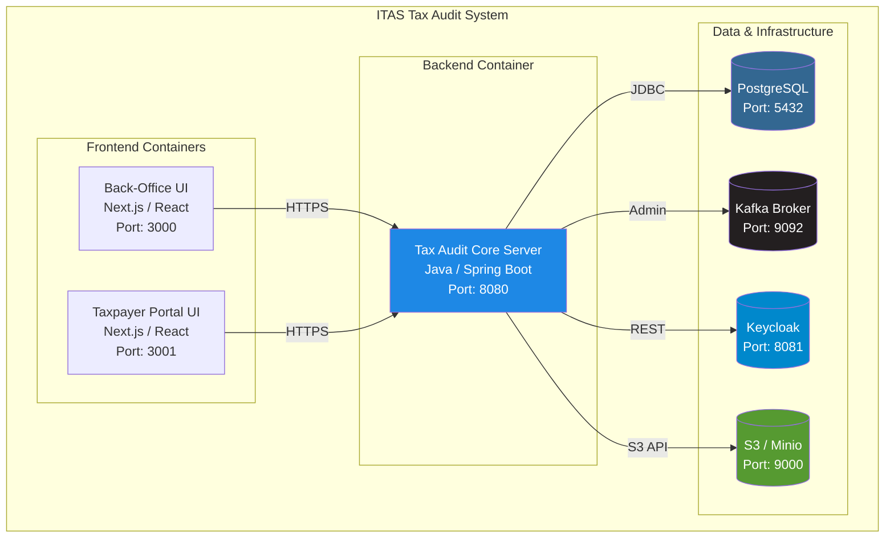

# Container Architecture

**Version:** 1.0
**Status:** Approved
**Last Updated:** 2026-08-18

This document defines the deployment-level containers and their interactions. It describes what runs where, how they communicate, and the infrastructure required to run the system.

---

## 1. Container Diagram



---

## 2. Container Descriptions

### 2.1 Frontend Containers

#### Back-Office UI (Port 3000)
- **Technology:** Next.js / React (TypeScript)
- **Purpose:** Internal user interface for tax auditors, team leaders, directors, etc.
- **Features:**
  - Annual Plan Management (view, create, approve)
  - Case Assignment & Tracking
  - Audit Execution (desk, comprehensive, TP, joint)
  - Report Generation
  - Quality Assurance Review
  - Dashboard & Analytics
- **Authentication:** Keycloak OIDC

#### Taxpayer Portal UI (Port 3001)
- **Technology:** Next.js / React (TypeScript)
- **Purpose:** Public interface for taxpayers to view audit notices and respond
- **Features:**
  - View Audit Notices
  - Upload Evidence/Documents
  - Respond to Assessments
  - View Audit Results
  - Message & Notification Center
- **Authentication:** Keycloak OIDC

### 2.2 Backend Container

#### Tax Audit Core Server (Port 8080)
- **Technology:** Java Spring Boot 3.x
- **Purpose:** Single deployable service containing all business logic
- **Structure:**
  - Domain Layer (pure business logic)
  - Application Layer (use cases & orchestration)
  - API Layer (REST endpoints)
  - Infrastructure Layer (persistence, external adapters)
  - Observability Layer (audit trail, logging, metrics)
- **Endpoints:**
  - Back-Office API (e.g., `/api/backoffice/ap`, `/api/backoffice/ex`)
  - Portal API (e.g., `/api/portal/notices`, `/api/portal/documents`)
  - Webhook API (e.g., `/api/webhook/risk-engine-events`)
  - Health Check (e.g., `/actuator/health`)

### 2.3 Data & Infrastructure Containers

#### PostgreSQL Database (Port 5432)
- **Version:** PostgreSQL 15+
- **Purpose:** Single central schema for all data
- **Storage:**
  - Tables owned by cluster prefixes (`ap_*`, `ex_*`, `tp_*`, etc.)
  - Shared infrastructure tables (`shared_audit_trail_entries`, `shared_outbox_entries`)
- **Backups:** Daily backups, 30-day retention (or as per policy)
- **SSL:** TLS 1.2+ for all connections

#### Kafka Broker (Port 9092)
- **Version:** Apache Kafka 3.x+
- **Purpose:** Event-driven communication between backend clusters and downstream consumers
- **Topics:**
  - `tax-audit-events` - Core audit lifecycle events
  - `fraud-events` - Fraud escalation events
  - `case-management-events` - Objection/dispute events
- **Consumers:**
  - Reporting Service (KPI dashboards)
  - Audit Service (fraud investigation)
  - Case Management Service (disputes)
- **Retention:** 7 days (can be extended for compliance)

#### S3 / Minio (Port 9000)
- **Purpose:** Object storage for DMS (Document Management System)
- **Objects:**
  - Audit evidence files
  - Audit reports (PDF)
  - Audit notices (PDF)
  - Working papers
  - Taxpayer documents
- **Buckets:**
  - `audit-evidence` - Uploaded evidence from field work
  - `audit-reports` - Generated reports
  - `audit-notices` - Generated notices
  - `taxpayer-documents` - Taxpayer submissions
- **Access:** S3 API compatible (AWS SDK or Minio client)
- **Security:** Server-side encryption enabled

#### Keycloak (Port 8081)
- **Version:** Keycloak 20+
- **Purpose:** Single source of truth for user authentication and authorization
- **Realms:**
  - `tax-audit` - Main realm for all users
- **Clients:**
  - `backend-server` - Backend API
  - `backoffice-ui` - Back-Office frontend
  - `portal-ui` - Taxpayer portal frontend
- **User Roles:**
  - `AUDITOR`, `TEAM_LEADER`, `PROCESS_OWNER`, `DIRECTOR`, `SENIOR_MANAGEMENT`
  - `REGIONAL_DIRECTOR`, `TAX_CENTER_MANAGER`, `TAXPAYER`, `QA_TEAM`
  - `JOINT_COMMITTEE`, `TP_COMMITTEE`
- **Authentication Flows:**
  - Authorization Code Flow (web applications)
  - Bearer Token (REST APIs)

---

## 3. Communication Patterns

### 3.1 Synchronous Communication (REST)
- Frontend → Backend (HTTPS)
- Backend → Keycloak (REST/OIDC)
- Backend → Risk Engine (REST, read-only)
- Backend → Registration Service (REST, read-only)

### 3.2 Asynchronous Communication (Kafka)
- Backend (Domain Events) → Kafka (Outbox Pattern)
- Kafka → Downstream Consumers (Event Subscribers)

### 3.3 Data Access (JDBC)
- Backend → PostgreSQL (JDBC connection pooling)

### 3.4 File Storage (S3 API)
- Backend → S3 / Minio (Upload/download via S3 API)

---

## 4. Phase 1 vs Phase 2 Deployment

### 4.1 Phase 1 (Development)
| Component | Deployment |
| :--- | :--- |
| Backend | Local Java process (`java -jar bs-taxaudit-core-server.jar`) |
| Frontend | Local Node.js dev server (`npm run dev`) |
| PostgreSQL | Docker container (`docker run -d postgres:15`) |
| Kafka | In-memory mock (no external broker) |
| S3 | Local filesystem mock |
| Keycloak | Docker container or mock auth |

**Deploy Command:**
```bash
# Terminal 1: PostgreSQL
docker run -d --name postgres -e POSTGRES_PASSWORD=password -p 5432:5432 postgres:15

# Terminal 2: Backend
cd backend/bs-taxaudit-core-server && mvn spring-boot:run -Dspring-boot.run.arguments="--spring.profiles.active=dev"

# Terminal 3: Back-Office UI
cd frontend/backoffice && npm run dev

# Terminal 4: Portal UI
cd frontend/portal && npm run dev
```

### 4.2 Phase 2 (Production)
| Component | Deployment |
| :--- | :--- |
| Backend | Kubernetes Pod (Spring Boot Docker image) |
| Frontend | Kubernetes Pod (Next.js Docker image) |
| PostgreSQL | Managed PostgreSQL (AWS RDS, Azure DB, etc.) |
| Kafka | Managed Kafka Cluster (Confluent Cloud, AWS MSK, etc.) |
| S3 | AWS S3 or MinIO instance |
| Keycloak | Managed or self-hosted Keycloak |

**Deploy Command:**
```bash
# Build images
docker build -t tax-audit-backend:latest ./backend/bs-taxaudit-core-server
docker build -t tax-audit-backoffice:latest ./frontend/backoffice
docker build -t tax-audit-portal:latest ./frontend/portal

# Push to registry
docker push tax-audit-backend:latest
docker push tax-audit-backoffice:latest
docker push tax-audit-portal:latest

# Deploy to Kubernetes
kubectl apply -f kubernetes/
```

---

## 5. Resource Requirements

### 5.1 Phase 1 (Local Development)
| Component | CPU | Memory | Storage |
| :--- | :--- | :--- | :--- |
| Backend | 2 cores | 2 GB | - |
| PostgreSQL | 1 core | 1 GB | 10 GB |
| Frontend (both) | 1 core | 1 GB | - |
| **Total** | **4 cores** | **4 GB** | **10 GB** |

### 5.2 Phase 2 (Production - Per Pod/Instance)
| Component | CPU | Memory | Storage | Replicas |
| :--- | :--- | :--- | :--- | :--- |
| Backend | 2 cores | 4 GB | - | 3+ |
| PostgreSQL | 4 cores | 8 GB | 100 GB+ | 1 (with standby) |
| Kafka | 2 cores | 4 GB | 50 GB+ | 3 |
| S3 | 2 cores | 4 GB | 500 GB+ | Variable |
| Keycloak | 1 core | 2 GB | - | 2+ |

---

## 6. Networking & Firewall Rules

### 6.1 Internal Network (Backend to Infrastructure)
- Backend → PostgreSQL: Port 5432 (JDBC)
- Backend → Kafka: Port 9092 (Broker)
- Backend → S3: Port 9000 (or 443 for AWS)
- Backend → Keycloak: Port 8081 (or 443)

### 6.2 External Network (Frontend to Backend)
- Back-Office UI → Backend: Port 8080 (HTTPS)
- Portal UI → Backend: Port 8080 (HTTPS)
- Both → Keycloak: Port 8081 (HTTPS)

### 6.3 Allowed Protocols
- HTTPS (TLS 1.2+) for all external communication
- JDBC (with SSL) for database connections
- S3 API (with SSL) for object storage

---

## 7. High Availability & Disaster Recovery

### 7.1 Backend Replicas
- Minimum 3 replicas in production
- Auto-scaling based on CPU/memory utilization
- Load balancer (nginx, HAProxy, or cloud LB)

### 7.2 Database Replication
- Primary-Standby replication
- Automated failover
- Daily backups (encrypted)
- 30-day retention

### 7.3 Kafka Replication
- Replication factor: 3
- Min in-sync replicas: 2
- Retention: 7 days (extendable)

### 7.4 RTO/RPO Targets
- **Recovery Time Objective (RTO):** < 15 minutes
- **Recovery Point Objective (RPO):** < 1 hour

---

## 8. Monitoring & Observability

### 8.1 Metrics
- Prometheus scrapes metrics from `/actuator/prometheus`
- Grafana dashboards for visualization
- Key metrics:
  - Request latency (p50, p95, p99)
  - Error rates per endpoint
  - Database connection pool utilization
  - Kafka lag per consumer group
  - Audit trail entries written

### 8.2 Logging
- Structured JSON logging (ELK/OpenSearch)
- Log levels: DEBUG (dev), INFO (uat), WARN (prod)
- Logs include: timestamp, level, logger, message, context

### 8.3 Tracing
- Distributed tracing (Jaeger or OpenTelemetry)
- Trace ID correlation across services
- Latency analysis for slow requests

### 8.4 Alerting
- Alert on high error rates (> 5%)
- Alert on high latency (p99 > 2s)
- Alert on low database availability
- Alert on Kafka consumer lag

---

## 9. Summary of Container Interactions

```
┌─────────────────────────────────────────────────────────────────┐
│                      ITAS Tax Audit System                       │
├─────────────────────────────────────────────────────────────────┤
│                                                                  │
│  ┌────────────────┐   ┌─────────────────┐   ┌────────────────┐ │
│  │  Back-Office   │   │  Taxpayer Portal │   │   Keycloak     │ │
│  │   UI (3000)    │   │    UI (3001)     │   │   (8081)       │ │
│  └────────┬────────┘   └────────┬─────────┘   └────────┬───────┘ │
│           │                     │                      │          │
│           └─────────────────────┼──────────────────────┘          │
│                                 │ HTTPS                           │
│                                 ▼                                 │
│                      ┌──────────────────────┐                     │
│                      │   Spring Boot Core   │                     │
│                      │  API Server (8080)   │                     │
│                      └──────┬───────┬───┬───┘                     │
│                             │       │   │                        │
│                 ┌───────────┘       │   └────────────────┐        │
│                 │                   │                    │        │
│                 ▼                   ▼                    ▼        │
│            ┌────────────┐    ┌──────────────┐    ┌──────────┐   │
│            │ PostgreSQL │    │    Kafka     │    │  S3 /    │   │
│            │  (5432)    │    │   (9092)     │    │  Minio   │   │
│            └────────────┘    └──────────────┘    └──────────┘   │
│                 │                    │                            │
│                 └────────┬───────────┘                            │
│                          │                                        │
│                          ▼                                        │
│              ┌─────────────────────────┐                         │
│              │  Downstream Consumers   │                         │
│              │  (Reporting, Fraud,     │                         │
│              │   Case Management)      │                         │
│              └─────────────────────────┘                         │
│                                                                  │
└─────────────────────────────────────────────────────────────────┘
```
