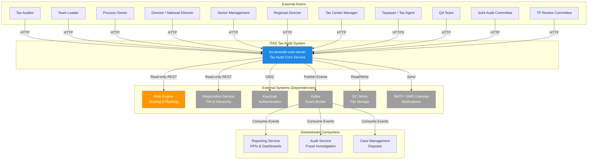

# System Context

**Version:** 1.0
**Status:** Approved
**Last Updated:** 2026-08-16

This document defines the boundaries of the ITAS Tax Audit & Investigation Management System. It shows who interacts with the system, what external systems it depends on, and the high-level data flow.

---

## 1. Context Diagram

---

## 2. External System Descriptions (with Phase 1 Strategy)

| System | Type | Direction | Purpose | Criticality | Phase 1 |
| :--- | :--- | :--- | :--- | :--- | :--- |
| **Risk Engine** | External REST API | Read-only | Provides risk heatmaps, scoped TIN lists, single TIN scores, and random samples. | High | Mock Client (in-memory data) |
| **Registration Service** | External REST API | Read-only | Provides taxpayer TIN, profile, and organizational hierarchy (Region/Tax Center mapping). | High | Mock Client (pre-seeded data) |
| **Keycloak** | External OIDC Provider | Authentication | Provides OIDC authentication. Populates `X-Actor-Id` header. | High | Mock Authentication (fixed test users) |
| **Kafka** | Event Broker | Outbound | Delivers outbox events to downstream consumers. | High | In-Memory Mock (no external broker) |
| **S3/Minio** | Object Storage | Read/Write | Stores evidence, reports, notices, and working papers. Managed by internal DMS. | High | Local Filesystem Mock |
| **SMTP/SMS Gateway** | Message Delivery | Outbound | Sends email and SMS notifications to taxpayers and internal users. | Medium | Console Log Mock |

---

## 3. Downstream Consumers (Outbound Events)

| Consumer | Events Consumed | Purpose |
| :--- | :--- | :--- |
| **Reporting Service** | `AnnualAuditPlanFinalized`, `AuditCaseClosed`, `AssessmentNoticeIssued`, etc. | Builds KPI dashboards, audit yield reports, productivity reports. |
| **Audit Service** | `FraudEscalatedFromIssueAudit`, `FraudInvestigationTriggered` | Handles fraud investigation workflows. |
| **Case Management Service** | `ObjectionRaised`, `ObjectionResolved` | Handles taxpayer objections and appeals. |

---

## 4. System Boundaries

### 4.1 In-Scope (Built by This Team)

| Category | Items |
| :--- | :--- |
| **Business** | All 25 BUCs (TA-001 to TA-025), 9 Clusters (AP, EX, TP, JA, CM, RF, QA, IA). |
| **Technical** | Internal Engines (Workflow, Rules, Notification, DMS, Ledger) - as mocks in Phase 1. |
| **Infrastructure** | Audit Trail (7-year retention), Transactional Outbox, REST APIs (Back-Office, Portal, Webhook, Internal). |

### 4.2 Out-of-Scope (Built by Other Teams)

| Category | Items |
| :--- | :--- |
| **Risk Engine** | Risk Scoring Models (ML), risk ranking logic. |
| **Registration Service** | Taxpayer Registration UI, TIN assignment. |
| **Fraud Investigation** | Full fraud investigation workflow (we only trigger handoff). |
| **Dispute Resolution** | Taxpayer appeals and objections workflow (we hand off). |
| **Infrastructure** | Kubernetes, Networking, Kafka Cluster management. |
