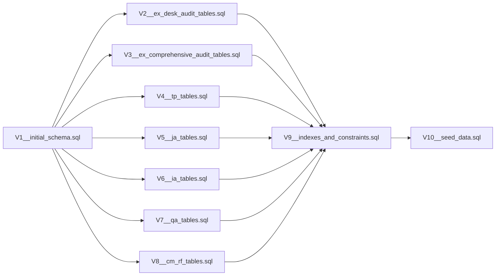

# Migration Strategy

**Version:** 1.0
**Status:** Approved
**Last Updated:** 2026-08-16

This document defines the Flyway migration strategy for the ITAS Tax Audit & Investigation Management System. It covers naming conventions, versioning, ownership, and execution order.

---

## 1. Flyway Overview

| Attribute | Decision |
| :--- | :--- |
| **Tool** | Flyway (Community Edition) |
| **Location** | `src/main/resources/db/migration/` |
| **Baseline Version** | `V1__initial_schema.sql` |
| **Naming Pattern** | `V{version}__{description}.sql` |
| **Version Format** | `V1`, `V2`, `V3`, ... |
| **Description** | Snake_case description of the migration |
| **Placeholder Replacement** | Enabled for environment-specific values |

---

## 2. Migration File Naming Convention

| Component | Format | Example |
| :--- | :--- | :--- |
| **Prefix** | `V` | `V` |
| **Version** | Integer (incremental) | `1`, `2`, `3`, ... |
| **Separator** | `__` (double underscore) | `__` |
| **Description** | Snake_case | `initial_schema`, `ex_desk_audit_tables` |

**Examples:**
- `V1__initial_schema.sql`
- `V2__ex_desk_audit_tables.sql`
- `V3__tp_tables.sql`
- `V4__ja_tables.sql`
- `V5__ia_tables.sql`
- `V6__qa_tables.sql`
- `V7__cm_rf_tables.sql`
- `V8__indexes_and_constraints.sql`
- `V9__seed_data.sql`
- `V10__audit_trail_trigger.sql`

---

## 3. Migration Ownership by Cluster

| Version | File Name | Cluster | Owner | Description |
| :--- | :--- | :--- | :--- | :--- |
| **V1** | `V1__initial_schema.sql` | Shared | **Pawlos** | Shared tables (audit_trail, outbox, documents, notifications) + AP tables |
| **V2** | `V2__ex_desk_audit_tables.sql` | EX | **Oliad** | Desk audit tables |
| **V3** | `V3__ex_comprehensive_audit_tables.sql` | EX | **Oliad** | Comprehensive audit tables |
| **V4** | `V4__tp_tables.sql` | TP | **Borifa** | Transfer Pricing tables |
| **V5** | `V5__ja_tables.sql` | JA | **Yoseph** | Joint Audit tables |
| **V6** | `V6__ia_tables.sql` | IA | **Borifa** | Issue Audit tables |
| **V7** | `V7__qa_tables.sql` | QA | **Oliad** | Quality Assurance tables |
| **V8** | `V8__cm_rf_tables.sql` | CM, RF | **Yoseph** | Communication and Reporting tables |
| **V9** | `V9__indexes_and_constraints.sql` | All | **Pawlos** | Additional indexes and foreign key constraints |
| **V10** | `V10__seed_data.sql` | All | **Pawlos** | Seed data for development (auditor profiles, tax centers, etc.) |

---

## 4. Detailed Migration File Contents

### 4.1 `V1__initial_schema.sql` (Shared + AP - Pawlos)
```sql
-- Shared Infrastructure Tables
-- shared_audit_trail_entries
-- shared_outbox_entries
-- shared_documents
-- shared_notifications

-- AP Cluster Tables
-- ap_annual_audit_plans
-- ap_plan_allocations
-- ap_plan_versions
-- ap_audit_cases
-- ap_audit_referrals
-- ap_auditor_profiles
-- ap_auditor_workload
-- ap_audit_work_logs
```

### 4.2 `V2__ex_desk_audit_tables.sql` (EX - Oliad)
```sql
-- ex_audit_plans
-- ex_desk_audit_details
-- ex_desk_audit_evidence
```

### 4.3 `V3__ex_comprehensive_audit_tables.sql` (EX - Oliad)
```sql
-- ex_comprehensive_audit_details
-- ex_caat_runs
-- ex_benchmark_comparisons
-- ex_third_party_matches
-- ex_query_sheets
-- ex_sample_selections
-- ex_zone_reports
```

### 4.4 `V4__tp_tables.sql` (TP - Borifa)
```sql
-- tp_risk_assessments
-- tp_working_hypotheses
-- tp_audit_plans
-- tp_field_work_data
-- tp_fact_statements
-- tp_analysis_results
-- tp_arm_length_analyses
-- tp_audit_reports
```

### 4.5 `V5__ja_tables.sql` (JA - Yoseph)
```sql
-- ja_joint_audits
-- ja_committees
-- ja_teams
-- ja_plans
-- ja_workspaces
-- ja_execution_reports
```

### 4.6 `V6__ia_tables.sql` (IA - Borifa)
```sql
-- ia_issue_audits
-- ia_issue_audit_scopes
-- ia_issue_audit_reports
-- ia_field_visit_findings
```

### 4.7 `V7__qa_tables.sql` (QA - Oliad)
```sql
-- qa_reviews
-- qa_recommendations
-- qa_sampling_seeds
```

### 4.8 `V8__cm_rf_tables.sql` (CM + RF - Yoseph)
```sql
-- cm_audit_notices
-- cm_alternative_delivery
-- cm_entry_conferences
-- rf_audit_reports
-- rf_approvals
-- rf_exit_conferences
-- rf_assessment_notices
-- rf_taxpayer_responses
```

### 4.9 `V9__indexes_and_constraints.sql` (All - Pawlos)
```sql
-- Additional performance indexes
-- Foreign key constraints that couldn't be defined earlier
-- Partial indexes for common queries
```

### 4.10 `V10__seed_data.sql` (All - Pawlos)
```sql
-- Seed auditor profiles for development
-- Seed tax center data
-- Seed default roles and permissions
-- Seed sample risk categories
-- Seed default sampling methods
```

---

## 5. Migration Execution Order



---

## 6. Migration Rules

| Rule | Description |
| :--- | :--- |
| **Rule 1** | Do NOT modify a migration file after it has been applied to a production database. Create a new migration instead. |
| **Rule 2** | All migration files must be idempotent (use `IF NOT EXISTS` where applicable). |
| **Rule 3** | Migration files must be reviewed by the code owner before merging. |
| **Rule 4** | Never run migrations manually in production. Use CI/CD pipelines. |
| **Rule 5** | Always test migrations on a staging environment before production. |
| **Rule 6** | Write rollback scripts for critical migrations (use `undo` migrations). |

---

## 7. Rollback Strategy

| Scenario | Approach |
| :--- | :--- |
| **Failed Migration** | Rollback to the last successful migration and fix the issue in a new migration. |
| **Data Corruption** | Restore from backup (point-in-time recovery). |
| **Schema Issue** | Create a new migration to fix the issue (do not modify existing migrations). |
| **Production Emergency** | Use `flyway undo` (if configured) or manual SQL scripts with proper testing. |

---

## 8. Development vs Production

| Environment | Migration Behavior |
| :--- | :--- |
| **Development** | Auto-migrate on startup (`spring.flyway.enabled=true`). Uses H2 or local PostgreSQL. |
| **Test** | Auto-migrate on startup. Uses Testcontainers with PostgreSQL. |
| **Staging** | Auto-migrate on deployment. Uses staging PostgreSQL. |
| **Production** | Auto-migrate on deployment with strict validation. Uses production PostgreSQL. |

---

## 9. Migration Commands

| Command | Purpose |
| :--- | :--- |
| `./mvnw flyway:migrate` | Apply pending migrations |
| `./mvnw flyway:baseline` | Baseline an existing database |
| `./mvnw flyway:validate` | Validate migrations against the database |
| `./mvnw flyway:info` | Show migration status |
| `./mvnw flyway:repair` | Repair the schema history table |
| `./mvnw flyway:clean` | Drop all objects (development only) |

---

## 10. CI/CD Integration

```yaml
# .gitlab-ci.yml or .github/workflows
migration:
  stage: deploy
  script:
    - ./mvnw flyway:migrate -Dflyway.url=$DATABASE_URL -Dflyway.user=$DATABASE_USER -Dflyway.password=$DATABASE_PASSWORD
  only:
    - main
    - staging
```

---

## 11. Best Practices

| Practice | Description |
| :--- | :--- |
| **Small Migrations** | Keep migrations small and focused on a single concern. |
| **Descriptive Names** | Use clear, descriptive names for migration files. |
| **Review** | Have migrations reviewed by another developer. |
| **Test** | Test migrations on a staging environment before production. |
| **Backup** | Always backup the database before running migrations in production. |
| **Idempotent** | Use `CREATE IF NOT EXISTS` and `ALTER TABLE IF EXISTS` to make migrations re-runnable. |

---

## 12. Example Migration File

```sql
-- File: V2__ex_desk_audit_tables.sql
-- Author: Oliad
-- Description: Creates desk audit tables for the EX cluster

-- Table: ex_desk_audit_details
CREATE TABLE IF NOT EXISTS ex_desk_audit_details (
    audit_case_id UUID PRIMARY KEY REFERENCES ap_audit_cases(id),
    outcome VARCHAR(32),
    draft_report_id UUID,
    escalation_recommendation TEXT,
    comprehensive_audit_required BOOLEAN,
    created_at TIMESTAMPTZ NOT NULL DEFAULT now(),
    updated_at TIMESTAMPTZ NOT NULL DEFAULT now()
);

-- Table: ex_desk_audit_evidence
CREATE TABLE IF NOT EXISTS ex_desk_audit_evidence (
    id UUID PRIMARY KEY DEFAULT gen_random_uuid(),
    audit_case_id UUID NOT NULL REFERENCES ap_audit_cases(id),
    source_type VARCHAR(32) NOT NULL,
    source_reference VARCHAR(256) NOT NULL,
    gathered_at TIMESTAMPTZ NOT NULL DEFAULT now()
);

-- Indexes
CREATE INDEX IF NOT EXISTS idx_desk_evidence_case ON ex_desk_audit_evidence (audit_case_id);

-- Comments
COMMENT ON TABLE ex_desk_audit_details IS 'Desk audit-specific details for each case';
COMMENT ON COLUMN ex_desk_audit_details.outcome IS 'NO_ISSUE, MINOR_ISSUE, BIG_ISSUE';
```
